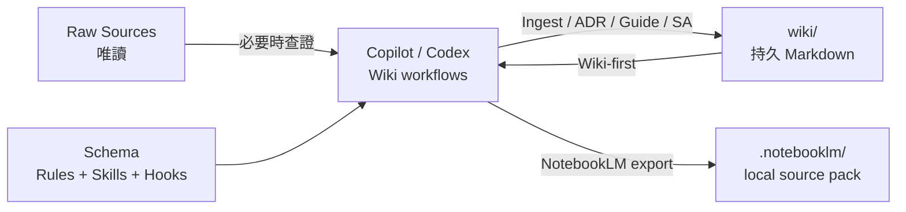

# Codebase LLM Wiki

> 讓 GitHub Copilot 或 OpenAI Codex 為任意 codebase 增量建構、查詢並維護可追溯的 Markdown 知識庫。

[](https://github.com/features/copilot)
[](https://openai.com/codex/)
[](https://www.python.org/)
[](https://obsidian.md/)
[](https://github.com/dennis8499/code-base-llm-wiki/releases/latest)

Codebase LLM Wiki 是一套給 coding agents 使用的持久知識框架。Agent 會把已理解的模組、實體、模式、決策與操作經驗整理到 `wiki/`，後續查詢先讀 Wiki，內容不足、過時或矛盾時才回溯 raw sources。

它不是 RAG：不建立向量資料庫、不複製完整原始碼，也不要求本機搜尋服務。知識以可閱讀、可版本控制、可交叉引用的 Markdown 持續累積。

---

## 目錄

- [專案結構](#專案結構)
- [核心組成](#核心組成)
- [主要特色](#主要特色)
- [快速開始](#快速開始)
- [版本與下載](#版本與下載)
- [操作方式](#操作方式)
- [E2E 驗證樣例](#e2e-驗證樣例)
- [文件索引](#文件索引)
- [相容性與設計邊界](#相容性與設計邊界)

---

## 專案結構

```text
code-base-llm-wiki/
├── .agents/skills/codebase-wiki/  # Copilot/Codex 共用 Skill、規格、模板與腳本
├── .codex/                         # Codex hooks、設定與明確委派時使用的 agents
├── .github/                        # Copilot agents、prompts、hooks 與 instructions
├── docs/                           # 架構、安裝、工作流、驗證及歷史文件
├── samples/task-tracker/           # 可操作的無第三方依賴 E2E 樣例
├── tests/                          # Installer、contract、guard 與 Repo 格式測試
├── wiki/                           # 持久 Markdown 知識庫與活動紀錄
├── .notebooklm/                    # 本地產生的 NotebookLM source pack（預設忽略）
├── AGENTS.md                       # Codex 專案規則與安全邊界
├── Codex.md                        # 可隨 Codex surface 安裝的獨立操作手冊
├── VERSION                         # 唯一產品版號來源
├── tools/release.py                # Release asset 與更新 manifest builder
├── ChangeLog.md                    # 版本變更紀錄
└── README.md                       # 本頁：專案導覽與快速開始
```

詳細元件關係與資料流請參閱 [架構文件](docs/architecture/README.md)。

---

## 核心組成

### 三層模型

| 層 | 位置 | 責任 |
| --- | --- | --- |
| Raw Sources | 目標 codebase 的原始碼、設定與既有文件 | Wiki 任務中唯讀 |
| Wiki | `wiki/` | Agent 產生與維護的持久知識 |
| Schema | `.agents/`、`.github/`、`.codex/`、`AGENTS.md` | 工作流、規格、guard 與平台入口 |



### 雙平台入口

| 能力 | GitHub Copilot | OpenAI Codex |
| --- | --- | --- |
| 全域規則 | `.github/copilot-instructions.md` | `AGENTS.md` |
| 共用流程 | `.agents/skills/codebase-wiki/` | `.agents/skills/codebase-wiki/` |
| 專業代理 | `.github/agents/*.agent.md` | `.codex/agents/*.toml` |
| 使用者入口 | `.github/prompts/*.prompt.md` | `Codex.md` 自然語言 recipes |
| Hooks | `.github/hooks/` | `.codex/hooks.json` |
| 輸出 | `wiki/` | `wiki/` |

兩個入口維持十個使用者意圖群組、十一個 machine operations 與相同安全邊界。日常任務由目前 Agent 處理；只有使用者明確要求 subagents、parallel 或 delegation 時才使用自訂代理。

### Wiki 工作流

| 工作流 | 用途 | 預設寫入 |
| --- | --- | --- |
| Install / setup | 安裝或升級框架入口 | dry-run；`--apply` 才寫入 |
| Ingest | 把 source evidence 整理成 Wiki | 需確認 |
| Query | Wiki-first 回答問題；符合條件時提供保存、更新或 Lint 選項 | 否 |
| Lint | 檢查 stale、連結、frontmatter、coverage；報告後提供修復選項 | 先報告 |
| Archaeology | 追蹤程式路徑與 Git 歷史 | 否 |
| ADR | 保存架構決策 | 是 |
| Synthesis / Guide | 保存長期分析或操作指南 | 是 |
| System Analysis / SA | 產生標示 coverage gaps 的 SA 文件 | 是 |
| NotebookLM export | 全專案安全掃描、功能導向補齊文件，再產生本地 Markdown source pack | 預覽後更新 `wiki/` 與 `.notebooklm/` |
| Delegation | 明確要求時分派專業代理 | 視任務而定 |

完整的提示詞與驗收條件請參閱 [工作流手冊](docs/workflows/README.md)。

---

## 主要特色

- **Wiki-first**：先讀 `wiki/index.md` 與相關頁面，再按需回溯 sources。
- **來源可追溯**：`sources` 保存 raw paths、`derived_from` 保存 Wiki 關係，
  `source_digest` 偵測同日內容變更。
- **增量維護**：透過 `wiki/index.md`、wikilinks 與 append-only `wiki/log.md` 累積知識。
- **雙入口同權**：Copilot 與 Codex 共用 intent、規格、模板與驗收契約。
- **後續操作建議**：高價值 Query 與 Lint findings 會以有界文字選項提示 Synthesis、Guide、重新 Ingest 或 Lint；不會自動寫入或 Hand-Off。
- **安全邊界**：`wiki-only` 安全專用、`coexist` 一般開發共存、`framework`
  框架維護；舊 `target` 是 `wiki-only` alias。
- **零第三方依賴 installer**：contract v3 提供 managed blocks、fingerprint
  manifest、動態 starter 日期與 staging/rollback。
- **單一 Hook 實作**：兩平台設定共用 Skill 下的 canonical hooks。
- **NotebookLM 全專案文件化**：強制 preflight ID 與必要文件 gate；source pack
  採 documents-first、`query-index`/`project-map` 導覽、穩定 logical source IDs、
  Basic DLP gate 與增量 upload plan。
- **可驗證**：跨 Python/Linux/Windows CI、parity、frontmatter、digest
  freshness、log/index、唯讀 lint 與單元測試。

---

## 快速開始

### 前置需求

- Git
- Python 3.11+
- GitHub Copilot Chat 或 OpenAI Codex，依使用入口選擇

### 安裝 GitHub Copilot surface

先預覽，再明確套用：

```powershell
python .agents\skills\codebase-wiki\scripts\install-framework.py install --target C:\path\to\your-repo --surface copilot --guard-mode wiki-only --format json
python .agents\skills\codebase-wiki\scripts\install-framework.py install --target C:\path\to\your-repo --surface copilot --guard-mode wiki-only --apply --format json
```

### 安裝 OpenAI Codex surface

```powershell
python .agents\skills\codebase-wiki\scripts\install-framework.py install --target C:\path\to\your-repo --surface codex --guard-mode wiki-only --format json
python .agents\skills\codebase-wiki\scripts\install-framework.py install --target C:\path\to\your-repo --surface codex --guard-mode wiki-only --apply --format json
```

安裝器會把 user-only 變更列為 `preserved`，只在同一受管內容同時有 upstream 與
local 變更時回報 `conflicts`。Root instructions 只更新 managed marker block。
完整安裝、升級與排錯說明請看 [安裝手冊](docs/setup/README.md)。

Installer 只發佈 `.agents/skills/codebase-wiki/`；同一工作目錄中的其他 Skills
不會外帶。`upgrade` 只同步 framework surface，既有 `wiki/` 保持不變。

---

## 版本與下載

產品版號唯一來源是根目錄的 `VERSION`，目前為 `0.2.0`。Installer 會把目前版本保存到目標 Repo 的
`.agents/skills/codebase-wiki/VERSION`，而 `contract_version: 3` 維持為獨立的
installer contract 版本。

本 Repo 尚未由擁有者選定 LICENSE，因此 release validate/build 會刻意阻擋新的
公開資產；下列連結只代表既有或未來正式發布位置，不代表 v0.2.0 已公開授權。

最新版本與下載：

- [查看所有 GitHub Releases](https://github.com/dennis8499/code-base-llm-wiki/releases)
- [下載 ZIP](https://github.com/dennis8499/code-base-llm-wiki/releases/latest/download/codebase-llm-wiki.zip)
- [下載 TAR.GZ](https://github.com/dennis8499/code-base-llm-wiki/releases/latest/download/codebase-llm-wiki.tar.gz)
- [下載更新 manifest](https://github.com/dennis8499/code-base-llm-wiki/releases/latest/download/update-manifest.json)

壓縮包包含完整框架 Repo；解壓後可依需求使用 `--surface copilot` 或
`--surface codex` 執行既有 installer。未來 Extension 可讀取 update manifest、
比較本地版本、驗證 SHA-256，再呼叫 `upgrade`；本 Repo 目前不包含 updater。

完整發佈流程請參閱 [版本、發佈與更新契約](docs/releases/README.md)。

---

## 操作方式

### GitHub Copilot

1. 在 VS Code 開啟已安裝框架的目標 Repo。
2. 進入 Copilot Chat 的 Agent 模式。
3. 使用自然語言，或選擇 `.github/prompts/` 提供的 prompt。
4. 例如輸入：`請先查 wiki，再必要時回溯 sources，說明訂單取消流程。`

### OpenAI Codex

Codex 直接讀取 `AGENTS.md` 與 `$codebase-wiki`。例如：

```text
請依照 AGENTS.md 的 Interactive Ingest 流程分析 src/orders，
先摘要職責、相依性與風險，再更新 wiki/index.md 與 wiki/log.md。
```

Codex 的 hooks、recipes、delegation 與排錯方式保留在可獨立安裝的 [Codex.md](Codex.md)。

NotebookLM Enterprise 匯出：

```text
請使用 $codebase-wiki 執行 NotebookLM export：先唯讀掃描整個專案的可分享 runtime source、
必要設定、schema/migrations 與既有文件，依功能列出納入/排除、Wiki coverage、預計新增或更新
的文件與容量預估，等待我確認。確認後以繁體中文補齊分層 Wiki，產生 query-index、project-map
與 .notebooklm source pack，並提供 Wiki-first 直接定位問題的 Custom instructions。
```

預覽使用 `export-notebooklm.py --preflight`，不寫入 Wiki 或 pack，並回傳一次性的
`preflight_id`。完成文件與確認後，使用
`--apply --preflight-id <id>`；任何 inventory、Wiki 或設定變更都要求重新
preflight。Exporter 不會呼叫雲端 API 或自動上傳，並會在本機執行 Basic DLP
檢核；未 allowlist finding 會阻擋 apply。

---

## E2E 驗證樣例

`samples/task-tracker/` 是一個只使用 Python 標準函式庫的 Task Tracker。它包含 entity、repository abstraction、service 狀態轉換、設定載入、例外分支與 injected clock，可驗證完整的 Ingest → Query → Lint 流程。

為避免把框架檔案寫進版本化樣例，請先複製樣例到暫存目錄，再安裝任一 surface。完整步驟與預期結果請看 [samples/README.md](samples/README.md)。

---

## 文件索引

| 文件 | 說明 |
| --- | --- |
| [架構與資料流](docs/architecture/README.md) | 三層模型、雙入口、Agents、Hooks、Installer 與安全邊界 |
| [安裝與升級](docs/setup/README.md) | 前置需求、兩種 surface、guard mode、相容性與排錯 |
| [工作流手冊](docs/workflows/README.md) | 十類意圖、12 個操作情境、平台對照與輸出契約 |
| [驗證手冊](docs/validation/README.md) | 自動檢查、E2E 驗收與發佈前清單 |
| [版本、發佈與更新契約](docs/releases/README.md) | SemVer、GitHub Release、下載資產與 Extension manifest |
| [Codex.md](Codex.md) | Codex 安裝後仍可使用的獨立操作手冊 |
| [ChangeLog.md](ChangeLog.md) | 框架重要變更 |
| [歷史方法論](docs/history/llm-wiki.md) | 上游概念的 attribution、原創摘要與權威來源連結 |

---

## 相容性與設計邊界

| 環境 | 狀態 | 備註 |
| --- | --- | --- |
| Windows / PowerShell | 支援 | Installer 與 scripts 使用 Python 3.11+ |
| macOS / Linux | 支援 | 使用對應的路徑語法執行相同 Python commands |
| GitHub Copilot Chat | 支援 | Agents、prompts、hooks 與共用 skill |
| OpenAI Codex | 支援 | AGENTS、repo-local skill、hooks 與 optional agents |
| Obsidian | 相容 | Wiki 使用 `[[wikilink]]` |
| NotebookLM Enterprise | 支援全專案文件化與離線匯出 | `query-index`、功能導向 `.md` 文件、必要 evidence、manifest、hash-based upload plan；不含雲端 API |

本框架不提供 RAG、向量資料庫、本機搜尋服務、MCP 搜尋服務、NotebookLM 雲端上傳 API 或自動修改 raw sources。
NotebookLM export 產生的是可供 NotebookLM 使用的 Markdown `query-index`，不是常駐搜尋引擎；
它只產生本地 `.notebooklm/`。SQL Server live evidence 僅是 Query 的唯讀子模式，且資料庫證據不得放進 frontmatter `sources`。

本 Repo 尚未宣告軟體授權；請勿從參考專案的授權狀態推定本專案授權。
