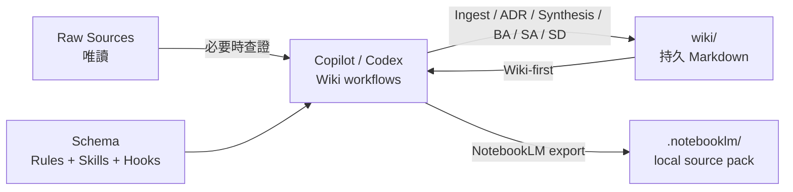

# Codebase LLM Wiki

> 讓 GitHub Copilot 或 OpenAI Codex 為任意 codebase 增量建構、查詢並維護可追溯的 Markdown 知識庫。

[](https://github.com/features/copilot)
[](https://openai.com/codex/)
[](https://www.python.org/)
[](https://obsidian.md/)
[](https://github.com/dennis8499/code-base-llm-wiki/releases/latest)

Codebase LLM Wiki 是一套給 coding agents 使用的持久知識框架。Agent 會把已理解的模組、實體、模式、決策與操作經驗整理到 `wiki/`，後續查詢先讀 Wiki，內容不足、過時或矛盾時才回溯 raw sources。

它不是 RAG：不建立向量資料庫、不複製完整原始碼，也不要求常駐本機搜尋服務。Windows x64
另可用隨 Skill 提供的 tgrep 加速 Ingest／Archaeology 的來源探索；知識仍以可閱讀、可版本控制、
可交叉引用的 Markdown 持續累積。

---

## 目錄

- [專案結構](#專案結構)
- [核心組成](#核心組成)
- [主要特色](#主要特色)
- [快速開始](#快速開始)
- [版本與下載](#版本與下載)
- [操作方式](#操作方式)
- [E2E 驗證樣例](#e2e-驗證樣例)
- [文件索引](#文件索引)
- [相容性與設計邊界](#相容性與設計邊界)

---

## 專案結構

```text
code-base-llm-wiki/
├── .agents/skills/codebase-wiki/  # Copilot/Codex 共用 Skill、規格、模板、腳本與 tgrep
├── .codex/                        # Codex hooks 與設定
├── .github/                       # Copilot VS Code prompts、hooks 與 instructions
├── docs/                          # 產品文件、操作文件與歷史材料
│   ├── README.md                  # 文件入口與建議閱讀順序
│   ├── product/                   # 架構與使用者工作流
│   │   ├── architecture/          # 元件、資料流與安全邊界
│   │   └── workflows/             # 使用者意圖與工作流契約
│   ├── operations/                # 安裝、驗證與發布
│   │   ├── setup/                 # 安裝、升級與平台設定
│   │   ├── validation/            # deterministic checks 與 E2E 驗收
│   │   └── releases/              # 版本、發布資產與更新契約
│   └── history/                   # 上游 attribution 與產品變更摘要
├── samples/task-tracker/          # 可操作的無第三方依賴 E2E 樣例
├── tests/                         # 依責任分組的 contract、installer、Wiki 與產品測試
│   ├── contracts/                 # 公開 contract 與 repository shape
│   ├── installer/                 # Copilot／Codex installer surface
│   ├── notebooklm/                # NotebookLM exporter 與 acceptance
│   ├── release/                   # Release builder
│   ├── samples/                   # E2E sample contract
│   └── wiki/                      # Wiki quality、hooks 與 provenance
├── tools/release.py               # Release asset 與更新 manifest builder
├── wiki/                          # 持久 Markdown 知識庫與活動紀錄
├── .notebooklm/                   # 本地產生的 NotebookLM source pack（預設忽略）
├── AGENTS.md                      # Codex 專案規則與安全邊界
├── Codex.md                       # 可隨 Codex surface 安裝的獨立操作手冊
├── VERSION                        # 唯一產品版號來源
├── ChangeLog.md                   # 版本變更紀錄
└── README.md                      # 本頁：專案導覽與快速開始
```

文件總覽請先參閱 [docs/README.md](docs/README.md)；詳細元件關係與資料流請參閱
[架構文件](docs/product/architecture/README.md)。

---

## 核心組成

### 三層模型

| 層 | 位置 | 責任 |
| --- | --- | --- |
| Raw Sources | 目標 codebase 的原始碼、設定與既有文件 | Wiki 任務中唯讀 |
| Wiki | `wiki/` | Agent 產生與維護的持久知識 |
| Schema | `.agents/`、`.github/`、`.codex/`、`AGENTS.md` | 工作流、規格、guard 與平台入口 |



### 雙平台入口

| 能力 | GitHub Copilot | OpenAI Codex |
| --- | --- | --- |
| 全域規則 | `.github/copilot-instructions.md` | `AGENTS.md` |
| 共用流程 | `.agents/skills/codebase-wiki/` | `.agents/skills/codebase-wiki/` |
| 使用者入口 | VS Code：`.github/prompts/*.prompt.md`；其他 hosts：共用 Skill／自然語言 | `Codex.md` 自然語言 recipes |
| Hooks | `.github/hooks/` | `.codex/hooks.json` |
| 輸出 | `wiki/` | `wiki/` |

兩個入口維持十一個使用者意圖群組、十一個 machine operations 與相同安全邊界；
工作由目前 Agent 透過共用 Skill 與平台入口完成。

Copilot prompt files 是 VS Code 本機 Agent 入口，不是 GitHub Copilot coding agent
或其他 hosts 的通用入口；其他 hosts 直接使用 `.agents/skills/codebase-wiki/`。
目前 v6 Copilot surface 的驗收狀態是 `static-compatible / runtime-unverified`；
Codex v6 也完成本機 contract、installer 與 deterministic 驗證，但尚未重跑 host
runtime UAT。2026-09-03 的 v4 runtime evidence 僅作歷史基線。平台範圍參考
[VS Code prompt files](https://code.visualstudio.com/docs/agent-customization/prompt-files)、
[Agent Skills](https://docs.github.com/en/copilot/concepts/agents/about-agent-skills)。

### Wiki 工作流

| 工作流 | 用途 | 預設寫入 |
| --- | --- | --- |
| Install / setup | 安裝或升級框架入口 | dry-run；`--apply` 才寫入 |
| Ingest | 把 source evidence 整理成 Wiki；可用 tgrep 加速來源定位 | 需確認 |
| Query | Wiki-first 回答問題；符合條件時提供保存、更新或 Lint 選項 | 否 |
| Lint | 檢查 stale、連結、frontmatter、coverage；報告後提供修復選項 | 先報告 |
| Archaeology | 追蹤程式路徑與 Git 歷史；可用 tgrep 加速來源定位 | 否 |
| ADR | 保存架構決策 | 是 |
| Synthesis | 保存長期跨領域分析 | 是 |
| Business Analysis / BA | 依 29148 與 IIBA profile 產生業務需求、流程、規則、指標與變更影響文件 | 是 |
| System Analysis / SA | 依 29148／15288／25010 profile 產生 solution-neutral 系統需求與驗證分析 | 是 |
| System Design / SD | 依 42010／25010 profile 產生 concerns、views、決策與品質策略 | 是 |
| NotebookLM export | 以當下完整 Codebase 建立每功能現況 BA／SA，供單一 Notebook 問答 | 一次預覽確認後更新 `wiki/` 與 `.notebooklm/` |

完整的提示詞與驗收條件請參閱 [工作流手冊](docs/product/workflows/README.md)。

---

## 主要特色

- **Wiki-first**：先讀 `wiki/index.md` 與相關頁面，再按需回溯 sources。
- **來源可追溯**：`sources` 保存 raw paths、`derived_from` 保存 Wiki 關係，
  `source_digest` 偵測同日內容變更。
- **來源探索加速**：Windows x64 以 Skill 內部 wrapper 使用固定版本 tgrep；只作 Ingest／
  Archaeology 的候選定位，索引不存在時安全 full scan，其他平台使用原有搜尋方式。
- **增量維護**：透過 `wiki/index.md`、wikilinks 與 append-only `wiki/log.md` 累積知識。
- **雙入口同權**：Copilot 與 Codex 共用 intent、規格、模板與驗收契約。
- **BA → SA → SD 標準對齊文件**：三份繁中 Markdown 可獨立產出，以穩定 ID
  建立追溯；證據不足仍保留章節與具體 Gap，不宣稱 ISO／IEEE conformance。
- **後續操作建議**：高價值 Query 與 Lint findings 會以有界文字選項提示 Synthesis、重新 Ingest 或 Lint；不會自動寫入或切換工作流。
- **安全邊界**：`wiki-only` 安全專用、`coexist` 一般開發共存、`framework`
  框架維護；舊 `target` 是 `wiki-only` alias。
- **零第三方依賴 installer**：contract v6 提供 managed blocks、fingerprint
  manifest、動態 starter 日期與 staging/rollback。
- **單一 Hook 實作**：兩平台設定共用 Skill 下的 canonical hooks。
- **NotebookLM 現況 BA／SA 知識包**：每次重掃安全 Codebase，以程式碼優先處理來源衝突，
  為每個 capability 產生互連的 BA／SA；一次確認後自動完成 readiness，透過雙識別碼、
  DLP masking、容量檢查與 stable source mapping 保持可驗證。
- **可驗證**：以 Python 3.11/3.14 在隔離 worktree 手動執行 unit、compile、
  parity、frontmatter、digest freshness、log/index 與唯讀 lint；本 Repo 不配置
  GitHub Actions。

---

## 快速開始

### 前置需求

- Git
- Python 3.11+
- GitHub Copilot Chat 或 OpenAI Codex，依使用入口選擇

Windows x64 的 Skill 內含 tgrep 1.0.5；tgrep 是選用的來源探索加速器，不是必要的常駐服務。

### 安裝 GitHub Copilot surface

先預覽，再明確套用：

```powershell
python .agents\skills\codebase-wiki\scripts\install-framework.py install --target C:\path\to\your-repo --surface copilot --guard-mode wiki-only --format json
python .agents\skills\codebase-wiki\scripts\install-framework.py install --target C:\path\to\your-repo --surface copilot --guard-mode wiki-only --apply --format json
```

### 安裝 OpenAI Codex surface

```powershell
python .agents\skills\codebase-wiki\scripts\install-framework.py install --target C:\path\to\your-repo --surface codex --guard-mode wiki-only --format json
python .agents\skills\codebase-wiki\scripts\install-framework.py install --target C:\path\to\your-repo --surface codex --guard-mode wiki-only --apply --format json
```

安裝器會把 user-only 變更列為 `preserved`，只在同一受管內容同時有 upstream 與
local 變更時回報 `conflicts`。Root instructions 只更新 managed marker block。
完整安裝、升級與排錯說明請看 [安裝手冊](docs/operations/setup/README.md)。

Installer 只發佈 `.agents/skills/codebase-wiki/`；同一工作目錄中的其他 Skills
不會外帶。`upgrade` 只同步 framework surface，既有 `wiki/` 保持不變。

### tgrep 來源探索

Windows x64 的 Ingest 與 Code Archaeology 可使用共用 wrapper：

```powershell
python .agents\skills\codebase-wiki\scripts\tgrep-search.py `
  --root . --path src --fixed --files-only --pattern "PaymentService"
```

Wrapper 只執行搜尋，不建立 `index` 或 `serve`；有既有 tgrep index/server 時可直接使用，
否則由 tgrep full scan。索引可能落後於檔案變更，需使用 `--no-index` 並直接重新讀 source
才能確認最新證據。`Query` 不使用 tgrep，仍遵守 Wiki-first 與無 CLI fallback 契約。
手動建立 index/server 時，請將 `.tgrep/` 保持在 target repo 的 Git ignore 中。

---

## 版本與下載

產品版號唯一來源是根目錄的 `VERSION`，目前為 `0.2.0`。Installer 會把目前版本保存到目標 Repo 的
`.agents/skills/codebase-wiki/VERSION`，而 `contract_version: 6` 維持為獨立的
installer contract 版本。

本 Repo 尚未由擁有者選定 LICENSE，因此 release validate/build 會刻意阻擋新的
公開資產；下列連結只代表既有或未來正式發布位置，不代表 v0.2.0 已公開授權。

最新版本與下載：

- [查看所有 GitHub Releases](https://github.com/dennis8499/code-base-llm-wiki/releases)
- [下載 ZIP](https://github.com/dennis8499/code-base-llm-wiki/releases/latest/download/codebase-llm-wiki.zip)
- [下載 TAR.GZ](https://github.com/dennis8499/code-base-llm-wiki/releases/latest/download/codebase-llm-wiki.tar.gz)
- [下載更新 manifest](https://github.com/dennis8499/code-base-llm-wiki/releases/latest/download/update-manifest.json)

壓縮包包含完整框架 Repo；解壓後可依需求使用 `--surface copilot` 或
`--surface codex` 執行既有 installer。未來 Extension 可讀取 update manifest、
比較本地版本、驗證 SHA-256，再呼叫 `upgrade`；本 Repo 目前不包含 updater。

完整發佈流程請參閱 [版本、發佈與更新契約](docs/operations/releases/README.md)。

---

## 操作方式

### GitHub Copilot

1. 在 VS Code 開啟已安裝框架的目標 Repo。
2. 進入 Copilot Chat 的 Agent 模式。
3. 使用自然語言，或在 VS Code 選擇 `.github/prompts/` 提供的 prompt。
4. 例如輸入：`請先查 wiki，再必要時回溯 sources，說明訂單取消流程。`

在 GitHub Copilot coding agent 或其他不支援 VS Code prompt files 的 host，請直接
以自然語言觸發 `.agents/skills/codebase-wiki/`，不要假設 `.github/prompts/`
會被載入。

### OpenAI Codex

Codex 直接讀取 `AGENTS.md` 與 `$codebase-wiki`。例如：

```text
請依照 AGENTS.md 的 Interactive Ingest 流程分析 src/orders，
先摘要職責、相依性與風險，再更新 wiki/index.md 與 wiki/log.md。
```

Codex 的 hooks、recipes 與排錯方式保留在可獨立安裝的 [Codex.md](Codex.md)。

NotebookLM Enterprise 匯出：

```text
請使用 $codebase-wiki 執行現況 BA／SA NotebookLM export：先做完整 safe discovery preflight，
列出納入/排除、功能、BA／SA 覆蓋、待分析內容、來源差異、DLP 與容量後等待我一次確認。
確認後依當下 Codebase 全量建立每功能的繁中 BA／SA、保留 user notes，自動完成 readiness
preflight，再產生 documents、query-index、project-map、shared business context、governance
與單一 Notebook source pack。
```

預覽使用 `export-notebooklm.py --preflight`，以 `--root` 指定的檔案系統目錄為掃描
邊界，不要求 `.git` 或 clean working tree，也不因 nested repository 阻擋。確認綁定
`discovery_id`；Wiki 更新後取得 latest readiness `preflight_id`，以兩者執行 `--apply`。
Exporter 僅讀 UTF-8 repo text，不會呼叫雲端 API 或自動上傳；documents 與 sources 的
DLP finding 先遮罩，residual 仍有命中才阻擋 apply，且沒有 allowlist。

---

## E2E 驗證樣例

`samples/task-tracker/` 是一個只使用 Python 標準函式庫的 Task Tracker。它包含 entity、repository abstraction、service 狀態轉換、設定載入、例外分支與 injected clock，可驗證 Interactive/Batch Ingest、Query、Lint 與 Archaeology 五項 active 流程。

為避免把框架檔案寫進版本化樣例，請先複製樣例到暫存目錄，再安裝任一 surface。完整步驟與預期結果請看 [samples/README.md](samples/README.md)。

---

## 文件索引

| 文件 | 說明 |
| --- | --- |
| [文件總覽](docs/README.md) | 文件分類、建議閱讀順序與框架 Repo 邊界 |
| [架構與資料流](docs/product/architecture/README.md) | 三層模型、雙入口、Hooks、Installer 與安全邊界 |
| [安裝與升級](docs/operations/setup/README.md) | 前置需求、兩種 surface、guard mode、相容性與排錯 |
| [工作流手冊](docs/product/workflows/README.md) | 十一類意圖、11 個操作情境、平台對照與輸出契約 |
| [驗證手冊](docs/operations/validation/README.md) | 本機 deterministic checks、E2E 驗收與發佈前清單 |
| [版本、發佈與更新契約](docs/operations/releases/README.md) | SemVer、GitHub Release、下載資產與 Extension manifest |
| [Codex.md](Codex.md) | Codex 安裝後仍可使用的獨立操作手冊 |
| [ChangeLog.md](ChangeLog.md) | 框架重要變更 |
| [歷史方法論](docs/history/llm-wiki.md) | 上游概念的 attribution、原創摘要與權威來源連結 |

---

## 相容性與設計邊界

| 環境 | 狀態 | 備註 |
| --- | --- | --- |
| Windows / PowerShell | 支援 | Installer 與 scripts 使用 Python 3.11+ |
| macOS / Linux | 支援 | 使用對應的路徑語法執行相同 Python commands |
| GitHub Copilot | `static-compatible / runtime-unverified` | VS Code 使用 prompts；其他 hosts 使用共用 Skill |
| OpenAI Codex | `static-compatible / v6 runtime-unverified` | v6 已通過本機契約與 deterministic checks；2026-09-03 的 v4 runtime evidence 只作歷史基線 |
| Obsidian | 相容 | Wiki 使用 `[[wikilink]]` |
| NotebookLM Enterprise | 支援完整 codebase 的現況 BA／SA 整理與離線匯出 | 一次確認、每功能 BA／SA、完整映射、DLP、schema v6 與 Google 官方治理清單；不含雲端 API |

本框架不提供 RAG、向量資料庫、必要的常駐搜尋服務、MCP 搜尋服務、NotebookLM 雲端上傳 API 或自動修改 raw sources。
隨 Skill 發佈的 Windows x64 tgrep 只供 Ingest／Archaeology 來源探索，並透過唯讀 wrapper 限制範圍。
NotebookLM export 產生的是可供 NotebookLM 使用的 Markdown `query-index`，不是常駐搜尋引擎；
它只產生本地 `.notebooklm/`。Wiki Query 不連線即時資料庫，也不呼叫 tgrep、資料庫工具或 fallback；
Repo 內的 `.sql`、migration 與 schema 仍可作為唯讀 source evidence。

本 Repo 尚未宣告軟體授權；請勿從參考專案的授權狀態推定本專案授權。
