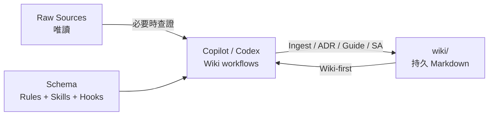

# Codebase LLM Wiki

> 讓 GitHub Copilot 或 OpenAI Codex 為任意 codebase 增量建構、查詢並維護可追溯的 Markdown 知識庫。

[](https://github.com/features/copilot)
[](https://openai.com/codex/)
[](https://www.python.org/)
[](https://obsidian.md/)

Codebase LLM Wiki 是一套給 coding agents 使用的持久知識框架。Agent 會把已理解的模組、實體、模式、決策與操作經驗整理到 `wiki/`，後續查詢先讀 Wiki，內容不足、過時或矛盾時才回溯 raw sources。

它不是 RAG：不建立向量資料庫、不複製完整原始碼，也不要求本機搜尋服務。知識以可閱讀、可版本控制、可交叉引用的 Markdown 持續累積。

---

## 目錄

- [專案結構](#專案結構)
- [核心組成](#核心組成)
- [主要特色](#主要特色)
- [快速開始](#快速開始)
- [操作方式](#操作方式)
- [E2E 驗證樣例](#e2e-驗證樣例)
- [文件索引](#文件索引)
- [相容性與設計邊界](#相容性與設計邊界)

---

## 專案結構

```text
code-base-llm-wiki/
├── .agents/skills/codebase-wiki/  # Copilot/Codex 共用 Skill、規格、模板與腳本
├── .codex/                         # Codex hooks、設定與明確委派時使用的 agents
├── .github/                        # Copilot agents、prompts、hooks 與 instructions
├── docs/                           # 架構、安裝、工作流、驗證及歷史文件
├── samples/task-tracker/           # 可操作的無第三方依賴 E2E 樣例
├── tests/                          # Installer、contract、guard 與 Repo 格式測試
├── wiki/                           # 持久 Markdown 知識庫與活動紀錄
├── AGENTS.md                       # Codex 專案規則與安全邊界
├── Codex.md                        # 可隨 Codex surface 安裝的獨立操作手冊
├── ChangeLog.md                    # 版本變更紀錄
└── README.md                       # 本頁：專案導覽與快速開始
```

詳細元件關係與資料流請參閱 [架構文件](docs/architecture/README.md)。

---

## 核心組成

### 三層模型

| 層 | 位置 | 責任 |
| --- | --- | --- |
| Raw Sources | 目標 codebase 的原始碼、設定與既有文件 | Wiki 任務中唯讀 |
| Wiki | `wiki/` | Agent 產生與維護的持久知識 |
| Schema | `.agents/`、`.github/`、`.codex/`、`AGENTS.md` | 工作流、規格、guard 與平台入口 |



### 雙平台入口

| 能力 | GitHub Copilot | OpenAI Codex |
| --- | --- | --- |
| 全域規則 | `.github/copilot-instructions.md` | `AGENTS.md` |
| 共用流程 | `.agents/skills/codebase-wiki/` | `.agents/skills/codebase-wiki/` |
| 專業代理 | `.github/agents/*.agent.md` | `.codex/agents/*.toml` |
| 使用者入口 | `.github/prompts/*.prompt.md` | `Codex.md` 自然語言 recipes |
| Hooks | `.github/hooks/` | `.codex/hooks.json`、`.codex/hooks/scripts/` |
| 輸出 | `wiki/` | `wiki/` |

兩個入口維持相同的九類意圖與安全邊界，但使用各平台原生能力。日常任務由目前 Agent 處理；只有使用者明確要求 subagents、parallel 或 delegation 時才使用自訂代理。

### Wiki 工作流

| 工作流 | 用途 | 預設寫入 |
| --- | --- | --- |
| Install / setup | 安裝或升級框架入口 | dry-run；`--apply` 才寫入 |
| Ingest | 把 source evidence 整理成 Wiki | 需確認 |
| Query | Wiki-first 回答問題 | 否 |
| Lint | 檢查 stale、連結、frontmatter、coverage | 先報告 |
| Archaeology | 追蹤程式路徑與 Git 歷史 | 否 |
| ADR | 保存架構決策 | 是 |
| Synthesis / Guide | 保存長期分析或操作指南 | 是 |
| System Analysis / SA | 產生標示 coverage gaps 的 SA 文件 | 是 |
| Delegation | 明確要求時分派專業代理 | 視任務而定 |

完整的提示詞與驗收條件請參閱 [工作流手冊](docs/workflows/README.md)。

---

## 主要特色

- **Wiki-first**：先讀 `wiki/index.md` 與相關頁面，再按需回溯 sources。
- **來源可追溯**：每頁 frontmatter 列出真實 repo-relative source paths。
- **增量維護**：透過 `wiki/index.md`、wikilinks 與 append-only `wiki/log.md` 累積知識。
- **雙入口同權**：Copilot 與 Codex 共用 intent、規格、模板與驗收契約。
- **安全邊界**：target mode 只允許 Wiki 寫入；framework mode 才允許維護框架檔案。
- **零第三方依賴 installer**：Python 標準函式庫即可 dry-run、安裝與升級。
- **可驗證**：提供 parity、frontmatter、stale-source、統計與單元測試。

---

## 快速開始

### 前置需求

- Git
- Python 3.11+
- GitHub Copilot Chat 或 OpenAI Codex，依使用入口選擇

### 安裝 GitHub Copilot surface

先預覽，再明確套用：

```powershell
python .agents\skills\codebase-wiki\scripts\install-framework.py install --target C:\path\to\your-repo --surface copilot --format json
python .agents\skills\codebase-wiki\scripts\install-framework.py install --target C:\path\to\your-repo --surface copilot --apply --format json
```

### 安裝 OpenAI Codex surface

```powershell
python .agents\skills\codebase-wiki\scripts\install-framework.py install --target C:\path\to\your-repo --surface codex --format json
python .agents\skills\codebase-wiki\scripts\install-framework.py install --target C:\path\to\your-repo --surface codex --apply --format json
```

安裝器遇到既有且內容不同的檔案會回報 `conflicts` 並停止，不會覆寫。完整安裝、升級與排錯說明請看 [安裝手冊](docs/setup/README.md)。

---

## 操作方式

### GitHub Copilot

1. 在 VS Code 開啟已安裝框架的目標 Repo。
2. 進入 Copilot Chat 的 Agent 模式。
3. 使用自然語言，或選擇 `.github/prompts/` 提供的 prompt。
4. 例如輸入：`請先查 wiki，再必要時回溯 sources，說明訂單取消流程。`

### OpenAI Codex

Codex 直接讀取 `AGENTS.md` 與 `$codebase-wiki`。例如：

```text
請依照 AGENTS.md 的 Interactive Ingest 流程分析 src/orders，
先摘要職責、相依性與風險，再更新 wiki/index.md 與 wiki/log.md。
```

Codex 的 hooks、recipes、delegation 與排錯方式保留在可獨立安裝的 [Codex.md](Codex.md)。

---

## E2E 驗證樣例

`samples/task-tracker/` 是一個只使用 Python 標準函式庫的 Task Tracker。它包含 entity、repository abstraction、service 狀態轉換、設定載入、例外分支與 injected clock，可驗證完整的 Ingest → Query → Lint 流程。

為避免把框架檔案寫進版本化樣例，請先複製樣例到暫存目錄，再安裝任一 surface。完整步驟與預期結果請看 [samples/README.md](samples/README.md)。

---

## 文件索引

| 文件 | 說明 |
| --- | --- |
| [架構與資料流](docs/architecture/README.md) | 三層模型、雙入口、Agents、Hooks、Installer 與安全邊界 |
| [安裝與升級](docs/setup/README.md) | 前置需求、兩種 surface、guard mode、相容性與排錯 |
| [工作流手冊](docs/workflows/README.md) | 九類意圖、11 個操作情境、平台對照與輸出契約 |
| [驗證手冊](docs/validation/README.md) | 自動檢查、E2E 驗收與發佈前清單 |
| [Codex.md](Codex.md) | Codex 安裝後仍可使用的獨立操作手冊 |
| [ChangeLog.md](ChangeLog.md) | 框架重要變更 |
| [歷史方法論](docs/history/llm-wiki.md) | 早期 LLM Wiki 概念，僅供設計脈絡參考 |

---

## 相容性與設計邊界

| 環境 | 狀態 | 備註 |
| --- | --- | --- |
| Windows / PowerShell | 支援 | Installer 與 scripts 使用 Python 3.11+ |
| macOS / Linux | 支援 | 使用對應的路徑語法執行相同 Python commands |
| GitHub Copilot Chat | 支援 | Agents、prompts、hooks 與共用 skill |
| OpenAI Codex | 支援 | AGENTS、repo-local skill、hooks 與 optional agents |
| Obsidian | 相容 | Wiki 使用 `[[wikilink]]` |

本框架不提供 RAG、向量資料庫、本機 source index、MCP 搜尋服務或自動修改 raw sources。SQL Server live evidence 僅是 Query 的唯讀子模式，且資料庫證據不得放進 frontmatter `sources`。

本 Repo 尚未宣告軟體授權；請勿從參考專案的授權狀態推定本專案授權。
