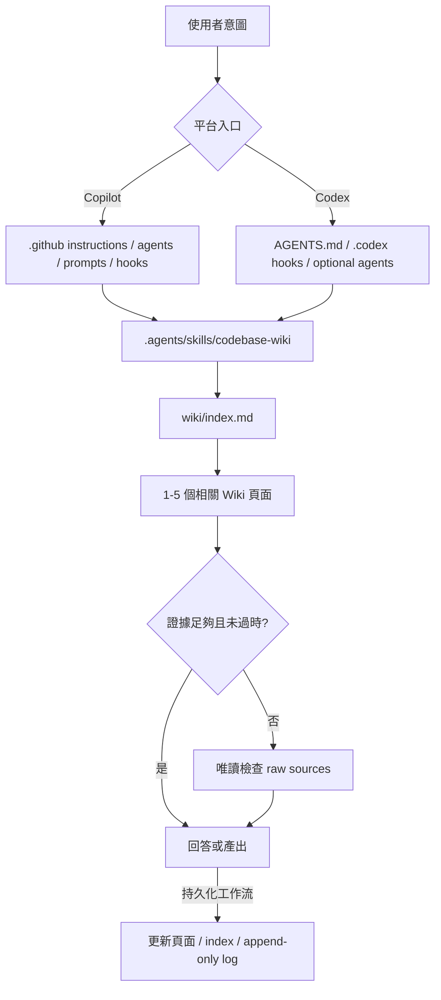

# Codebase LLM Wiki 架構

本文件說明 Codebase LLM Wiki 的三層模型、Copilot/Codex 雙入口、Agent 職責、Hooks、Installer 與資料流。日常使用請從根目錄 [README](../../README.md) 開始。

## 三層模型

| 層 | 內容 | 寫入規則 |
| --- | --- | --- |
| Raw Sources | 目標專案的原始碼、設定、既有文件與 Git history | Wiki 任務只能讀取 |
| Wiki | `wiki/` 下的 Markdown 頁面、索引與活動紀錄 | 依工作流建立或更新 |
| Schema | `AGENTS.md`、`.agents/`、`.github/`、`.codex/` | 只有框架安裝或維護才變更 |

## 雙入口與共用契約

`.agents/skills/codebase-wiki/capabilities.json` 宣告 contract version 2、支援 surface 與 intent 寫入語意。Copilot 和 Codex 各自使用平台原生設定，但共用以下內容：

- intent routing、frontmatter、log operations 與工作流 references；
- Wiki page templates；
- installer、parity、frontmatter、stale-source 與統計 scripts；
- Raw Sources 唯讀、Wiki-first、append-only log 與 evidence-backed 的核心規則。

平台 adapter 不需要逐 byte 相同；`parity-check.py` 驗證兩邊仍公開相同能力且沒有指向已移除的舊路徑。

## Agent 職責

| Agent | 主要責任 | 預設寫入 |
| --- | --- | --- |
| `wiki-keeper` | 意圖路由、ADR、Guide、Synthesis、SA 與跨流程協調 | 視工作流 |
| `wiki-ingest` | 讀取 source evidence 並建立或更新 Wiki | 是 |
| `wiki-query` | 先查 Wiki，必要時回溯 sources 或唯讀 DB evidence | 否 |
| `wiki-lint` | 檢查 stale、frontmatter、連結、index 與 coverage | 先報告 |
| `wiki-archaeologist` | 追蹤 call path、特殊分支與非破壞性 Git history | 否 |

日常任務由目前 Agent 直接完成。只有使用者明確要求 delegation、subagents、parallel 或 swarm 時，才啟用 `.github/agents/` 或 `.codex/agents/` 的專業代理；框架不強制固定的多階段 orchestration。

## Wiki 資料模型

每頁必須有 `title`、`type`、`sources`、`last_updated`、`tags` 與 `status`。頁面之間使用 Obsidian-compatible `[[wikilink]]`；source paths 使用相對 Repo root 的實際路徑。

`wiki/index.md` 是導覽入口，`wiki/log.md` 是 append-only 時序紀錄。新增、刪除、改名或重大更新頁面時必須同步 index；Ingest、Lint、ADR、Guide、Synthesis、SA 與重大框架更新必須追加 log。

## Hooks 與安全邊界

兩個平台各自配置相同目的的三個 hook：

| Hook | 時機 | 作用 |
| --- | --- | --- |
| `wiki-session-init` | Session start | 產生 Wiki 狀態與近期活動的 audit 摘要 |
| `wiki-write-guard` | Edit tool 前 | 依 guard mode 拒絕超出範圍的寫入 |
| `wiki-log-reminder` | Edit tool 後 | 記錄可能需要追加 log 的 Wiki 變更 |

`target` mode 只允許 `wiki/`；`framework` mode 允許本 Repo 的 Wiki、schema、文件、樣例與測試。無效或缺失設定會 fail closed 到 `target`。

Hooks 是 deterministic guardrail，不取代平台 sandbox，也不授權 Agent 修改 raw sources。

## Installer

`.agents/skills/codebase-wiki/scripts/install-framework.py` 只使用 Python 標準函式庫：

1. `install` 或 `upgrade` 預設只產生 file plan；
2. 指定 `--apply` 且沒有 conflicts 時才寫入；
3. `--surface copilot|codex` 決定平台入口；
4. framework config 在安裝到目標 Repo 時轉成 `target` mode；
5. 舊 `.codebase-wiki/` 只透過 `obsolete_paths` 回報，不自動刪除。

框架 Repo 根目錄的 `wiki/` 是框架自己的持久知識，不會複製到目標專案；目標 Wiki 由 `.agents/skills/codebase-wiki/assets/wiki-starter/` 的乾淨骨架建立。`docs/`、`samples/` 與 `tests/` 同樣不屬於 installer surface。

## 設計邊界

- 不建立向量資料庫、SQLite source index 或 Tree-sitter cache。
- Query 不因讀取而自動持久化結果。
- SQL Server live evidence 只允許 bounded read-only evidence，且不能放入 frontmatter sources。
- 不建立 project-level Codex slash prompts；Codex 使用自然語言 recipes。
- 不允許 delegation 隱性改變寫入或安全邊界。
