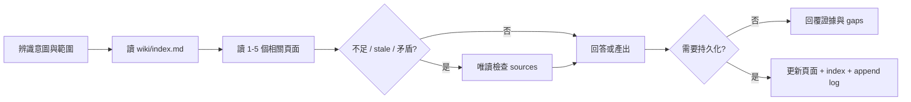

# Wiki 工作流手冊

本文件把 Codebase LLM Wiki 的九類意圖展開成 11 個常用操作情境。所有工作流都遵守 Wiki-first、raw sources 唯讀、evidence-backed 與 append-only log 規則。

## 共通流程



## 平台入口對照

| 情境 | Copilot prompt / Agent | Codex 自然語言 recipe | 主要產出 |
| --- | --- | --- | --- |
| 1. Interactive Ingest | `/ingest-module {path}` | `分析 {path}，先摘要再更新 wiki` | module/entity/pattern pages |
| 2. Batch Ingest | `/ingest-batch {path}` | `批次掃描 {path} 建立初始 wiki` | overview、architecture、modules |
| 3. Query | `/query-wiki {question}` | `先查 wiki，再必要時回溯 sources` | 唯讀答案與 citations |
| 4. Query + SQL evidence | `wiki-query` | `需要時使用有界唯讀 SQL evidence` | 標示 metadata 的即時證據 |
| 5. Lint | `/lint-wiki` | `依 lint 流程列出 critical/warning` | 健康報告；確認後修復 |
| 6. Archaeology | `/code-archaeology {target}` | `追蹤 {target} 行為與 git history` | 現況、歷史證據、推論 |
| 7. ADR | `/new-adr {title}` | `建立 ADR：{title}` | `wiki/decisions/` record |
| 8. Synthesis | `/save-synthesis {topic}` | `保存 {topic} 的跨模組分析` | `wiki/synthesis/` page |
| 9. Guide | `/save-guide {topic}` | `建立 {topic} 操作指南` | `wiki/guides/` page |
| 10. System Analysis / SA | `/system-analysis-doc {scope}` | `產出 {scope} SA 文件` | synthesis + coverage gaps |
| 11. Delegation | 明確選擇或要求 agents | `請使用 subagents/parallel...` | 受限範圍的代理協作 |

## 1. Interactive Ingest

適合單一模組或新功能。Agent 先回報責任、公開介面、相依性、特殊邏輯、風險與問題；確認後才建立或更新 Wiki。新增或重大更新頁面後同步 index，並使用 `ingest` 追加 log。

```text
請分析 src/orders。先摘要模組職責、主要介面、相依性、特殊分支與風險；
確認證據足夠後建立或更新 wiki，補上 wikilinks、index 與 log。
```

## 2. Batch Ingest

適合第一次導入或大型目錄。優先讀 README、entrypoints、exports/imports、routes、services、models 與 config；依 dependency order 建立 overview、architecture、modules 與 entities。缺少證據時使用 placeholder 或 gap，不推測行為。

## 3. Query

Query 預設唯讀。先讀 index 和 1–5 個相關 Wiki pages；只有 Wiki 不足、stale 或矛盾時才回溯 frontmatter sources。回答同時指出使用的 Wiki 頁面、source paths、推論與未驗證 gaps。

## 4. Query + SQL Server Live Evidence

只有問題需要目前資料庫事實且工具可用時啟用。允許 schema discovery、metadata lookup 與有界 `SELECT`；禁止 DML、DDL、`EXEC`、stored procedure、無界掃描與 credential disclosure。

回答必須標示連線時間、工具、server、database、query scope、limit、row count 與 freshness。DB evidence 不得放入 frontmatter `sources`；工具不可用時回退到 Wiki/source evidence 並清楚說明限制。

## 5. Lint

檢查 stale sources、orphan pages、broken wikilinks、missing pages、frontmatter、contradictions、index completeness 與 coverage。先依 Critical、Warning、Info 報告，只有使用者接受後才做廣泛修復；持久化修復使用 `lint` 追加 log。

## 6. Archaeology

從具體 entrypoint、symbol 或 field 開始，追蹤 call paths 和異常分支，再使用 `git log`、`git blame`、`git show` 等非破壞性命令補足歷史。分開標示目前 source evidence、Git evidence、inference 與 uncertainty。預設不持久化。

## 7. ADR

將 architecture choice 寫入 `wiki/decisions/`，使用 decision frontmatter、context、options、decision、consequences 與 evidence。建立後更新 index 並以 `adr` 追加 log。

## 8. Synthesis

保存跨模組、風險、技術債或長期有價值的分析。內容必須基於 Wiki 或 raw sources；推論要明確標示。寫入 `wiki/synthesis/`，更新 index 並以 `synthesis` 追加 log。

## 9. Guide

建立 onboarding、debugging、operations、setup、contribution 或 runbook。包含 audience、prerequisites、actionable steps、pitfalls、gaps 與相關 wikilinks。寫入 `wiki/guides/`，更新 index 並以 `guide` 追加 log。

## 10. System Analysis / SA

先建立 Wiki coverage map，再補查不足的 raw sources。輸出存於 `wiki/synthesis/`，使用 `type: synthesis` 與 `tags: [synthesis, system-analysis]`。缺少 deployment、data flow、NFR 或 stakeholder evidence 時列為 coverage gap，不虛構內容。

## 11. Delegation

Delegation 只有在使用者明確要求時啟用。委派內容必須包含目標、範圍、Wiki 現況、使用者偏好與交付格式；subagent 不會因此獲得更寬的寫入權限，也不能跳過 index/log/frontmatter 規則。

## 交付檢查

- 回報新增、更新與未變更的 Wiki/schema files。
- 需要時確認 `wiki/index.md` 已同步。
- 需要時確認 `wiki/log.md` 只有追加。
- 列出執行的 deterministic checks 與結果。
- 明確說明 stale、speculative、skipped 或 unverified points。

