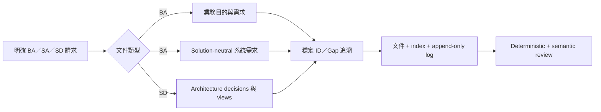

# 產出 BA／SA／SD 分析與設計文件

<!-- codebase-wiki:managed:start -->

## 業務目的與範圍

本流程讓使用者針對整體系統或指定 scope，分別建立 Business Analysis、
solution-neutral System Analysis 或 System Design。三份文件可以單獨產出；存在上游
時以穩定 ID 銜接，不存在時登錄具體 Gap。

## 角色

| 角色 | 主要責任 |
| --- | --- |
| 知識維護者 | 選擇文件與 scope、確認 Wiki 狀態、執行檢核 |
| Business Analyst／Product Owner | 確認業務目的、needs、policy、target state 與 success measures |
| System Analyst | 把需求整理成 solution-neutral SR/NFR/IF 與 V&V needs |
| Architect／Engineer | 把 SA drivers 映射成 decisions、views 與 quality strategy |
| Reviewer | 確認 evidence、Gap、追溯與 standard-aligned 限定語意 |

## 觸發與前置條件

- 觸發：明確提出 `BA文件`、`SA文件`、`SD文件` 或對應 document request。
- 前置：Codebase LLM Wiki 已安裝；不要求 BA／SA 上游一定存在。
- 路由例外：含 NotebookLM、export、source pack 時改走
  [[notebooklm-ba-knowledge-export]]；只有裸稱 `BA` 時才澄清。

## 主流程

| 步驟 | 觸發／條件 | 角色 | 業務行為 | 資料讀寫 | 狀態前／後 | 成功結果 | 失敗／下一步 | 證據定位 |
| --- | --- | --- | --- | --- | --- | --- | --- | --- |
| 1 | 明確提出 BA／SA／SD 文件請求 | 知識維護者 | 確認文件類型、scope 與固定輸出路徑 | 讀取使用者請求；選擇 workflow | `request_received`／`route_selected` | 唯一 workflow 被選定 | 裸稱 BA 時先澄清；含 NotebookLM 時改走專用流程 | `.agents/skills/codebase-wiki/references/intent-routing.md:1` |
| 2 | `route_selected` | 系統 | 讀 index、近期 log 與相關 Wiki | 讀取 `wiki/index.md`、頁面與 log | `route_selected`／`evidence_baseline` | 建立 Wiki-first evidence baseline | 缺頁或 stale 時標 gap 並唯讀回溯 raw source | `.agents/skills/codebase-wiki/references/business-analysis-workflow.md:45` |
| 3 | Wiki evidence 缺漏、過期或矛盾 | 系統 | 唯讀查證 raw sources，沿入口追呼叫鏈與資料／失敗分支 | 讀取 code/config/schema/tests；不寫 raw source | `evidence_baseline`／`evidence_checked` | 補足可觀察行為與 locator | 沒有證據標 `evidence-gap`，未完成追查標 `analysis-gap` | `.agents/skills/codebase-wiki/references/system-analysis-workflow.md:48` |
| 4 | evidence 已整理 | Analyst／Architect | 建立 standards matrix、coverage map、stable IDs、traceability 與 Gap | 寫入 synthesis 文件內容；讀取標準與模板 | `evidence_checked`／`document_draft` | 不完整資訊仍可審查 | 不得編造需求、政策或步驟，列具體 Gap | `.agents/skills/codebase-wiki/references/business-analysis-workflow.md:75` |
| 5 | 文件章節與參與者有證據 | 系統 | 產生 Mermaid slots；檢查 actor、狀態、轉換 | 讀取 coverage map；寫入 managed block | `document_draft`／`diagram_checked` | supported diagram 或 concrete Gap | 關係未被證據支持時保留 Gap，不畫推測圖 | `.agents/skills/codebase-wiki/references/system-analysis-workflow.md:101` |
| 6 | draft 通過 marker 規則 | 系統 | 更新 managed，保留 user-notes/local-only | 讀寫 Wiki；local-only 保存技術 provenance | `diagram_checked`／`document_ready` | 文件可安全重產且人工 notes 不變 | marker／frontmatter 不合法時停止寫入並修正 | `.agents/skills/codebase-wiki/references/business-analysis-workflow.md:111` |
| 7 | 文件 ready | 知識維護者 | 同步 index、append log 並執行 checks | 寫入 `wiki/index.md`、`wiki/log.md`；讀取驗證結果 | `document_ready`／`published` | 可驗證的 durable Markdown | checks 失敗則保留現況並回報未完成項目 | `.agents/skills/codebase-wiki/references/business-analysis-workflow.md:123` |

## 替代與例外流程

- 缺少上游文件：以 `gap-*-ba-*` 或 `gap-*-sa-*` 代替未知 link，不中止。
- 證據不足：保留章節與 Mermaid 槽位，以 Gap 說明所需來源，不畫圖。
- Legacy SA 無 markers：首次重跑先逐字保存原正文到 user-notes legacy snapshot。
- 重跑已有 markers 文件：只替換 managed，人工 notes 不變。
- `analysis-gap` 代表呼叫鏈尚未追查完成，`evidence-gap` 代表來源查過但沒有事實，
  `business-confirmation` 代表實作可見但政策／責任待確認；後兩種保留已知觀察。

## 業務規則

`standards-alignment-not-conformance`：文件對齊標準不等於取得外部認證；
`missing-evidence-remains-gap`：來源未支持的事實必須保留具體 Gap，不得補造答案。

- [[standards-alignment-not-conformance]]
- [[missing-evidence-remains-gap]]

## 輸入、輸出與狀態轉換

| 輸入狀態 | 行為 | 輸出狀態 |
| --- | --- | --- |
| Wiki evidence 足夠 | 產出完整章節與 supported diagrams | `coverage_status: covered` |
| 核心目的有證據、局部不足 | 產出可用內容並登錄 Gaps | `coverage_status: partial` |
| 核心 baseline 無法成立 | 保留文件、章節與問題清單 | `coverage_status: gap` |

`status: active` 代表 freshness，與 coverage 分開。輸出固定為 Markdown；不產生
PDF、DOCX、外部 API 呼叫或自動標準更新。

## 上下游影響

- BA IDs：`cap-*`、`fr-*`、`bp-*`、`br-*`、`AC-*`。
- SA IDs：`SR-*`、`NFR-*`、`IF-*`。
- SD IDs：`DE-*`、`VIEW-*` 與既有 ADR。
- Standalone BA／SA／SD 保留在一般文件工作流；NotebookLM 另由專用 current-state
  profiles 產生每 capability BA／SA，SD 與一般分析文件維持 local traceability。

## 成功結果

使用者取得一份可單獨閱讀、可重產、可驗證且不隱藏缺口的標準對齊文件；存在三層
文件時可沿穩定 IDs 由業務目的追到 system requirement、design decision/view 與
verification strategy。

## 待確認事項

- `gap-analysis-doc-runtime-uat`：新 Copilot prompt adapters 尚未在實際 host 做 runtime 驗收。
- `gap-analysis-doc-formal-adr`：共用文件架構尚未由專案擁有者建立 accepted ADR。

## 相關頁面

- [[business-analysis]]
- [[system-analysis]]
- [[system-design]]
- [[functional-requirement-catalog]]
- [[business-process-catalog]]
- [[business-rule-catalog]]

<!-- codebase-wiki:managed:end -->

<!-- codebase-wiki:user-notes:start -->
## BA 補充註記

目前無人工補充。
<!-- codebase-wiki:user-notes:end -->

<!-- notebooklm:local-only:start -->
## 本機追溯關聯

- [[project-function-catalog]]
- [[system-architecture]]
<!-- notebooklm:local-only:end -->
