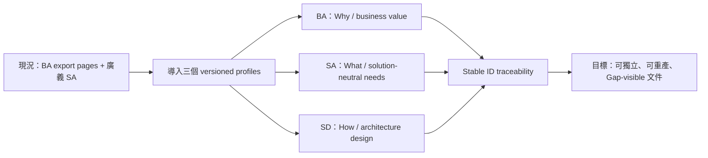
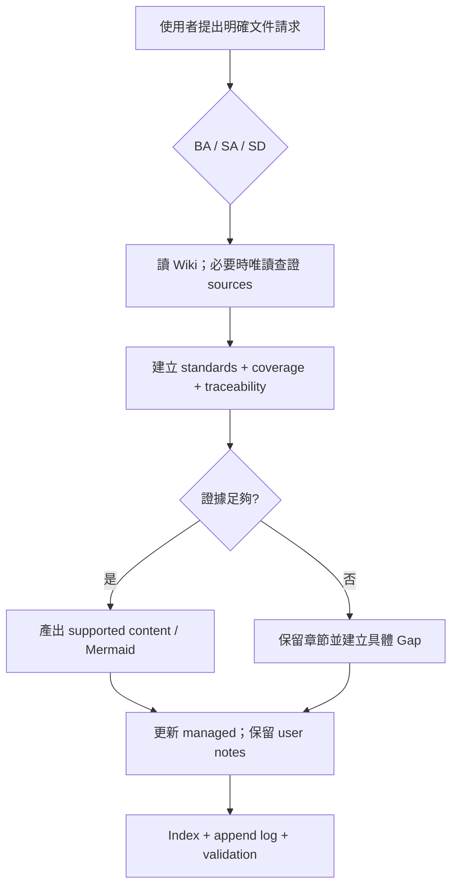

# Codebase LLM Wiki Business Analysis

<!-- codebase-wiki:managed:start -->

## 文件控制

| 欄位 | 值 |
| --- | --- |
| 文件 ID／版本 | BA-CODEBASE-WIKI-001 / v1 |
| 範圍 | Codebase LLM Wiki 的 BA／SA／SD 文件產出能力 |
| 產出日期／證據基準日 | 2026-09-04 / 2026-09-04 |
| Owner／Reviewer | Project owner（待具名）／framework maintainer |
| 標準 Profile | `business-analysis-aligned-v1` |
| 文件狀態／Coverage | active / partial |
| 變更摘要 | 新增獨立 BA、重整 solution-neutral SA、新增 SD，建立三層追溯與 Gap 契約 |

> 本文件為 standard-aligned，不代表 ISO／IEEE／IIBA conformance、認證或稽核通過。

## 執行摘要

框架原本只有一份廣義 SA，混合需求分析、架構、元件、部署與技術風險；`BA` 主要
指 NotebookLM 業務知識匯出，沒有可單獨產出的 Business Analysis 文件。目標能力是讓
使用者依同一份 Wiki evidence 分別產出 BA、solution-neutral SA 與 SD，以 stable IDs
追溯，並在證據不足時明列 Gap，而不是中止或補寫想像內容。

核心價值是分離「為何／要什麼／如何設計」三個問題，讓 Business Analyst、System
Analyst、Architect 與 reviewer 能審查自己關心的 abstraction level。三份文件仍是
繁中 Markdown，可獨立生成，不新增 PDF/DOCX、CLI generator、外部套件或雲端服務。

## 標準對照矩陣

| Profile reference | 對齊主題 | 本文件章節 | Coverage | Evidence／Gap |
| --- | --- | --- | --- | --- |
| ISO/IEC/IEEE 29148:2018 | stakeholder/business needs、requirements characteristics、traceability | Stakeholders、能力與需求、BA → SA 追溯 | partial | 功能契約與 tests 已建立；正式 stakeholder sign-off 待補 |
| IIBA Business Analysis Standard v2.0 | context、value、stakeholders、needs、change | 問題／機會、current/target、change impact | partial | framework public contract 已落地；adoption owner 與 KPI 尚待確認 |

## Coverage Map

| BA section | Status | Evidence／Gap ID |
| --- | --- | --- |
| Business context, problem, opportunity | covered | [[overview]]、既有 [[system-analysis]] legacy snapshot |
| Scope and outcomes | covered | [[business-analysis-document]]、[[system-analysis-document]]、[[system-design-document]] |
| Stakeholders and needs | partial | 使用者與文件角色已知；`gap-analysis-doc-owner-approval` |
| Current and target state | covered | capability contract v3→v4 與三工作流差異 |
| Capabilities and requirements | covered | `cap-analysis-document-generation` 與三個 `fr-*` |
| Business processes and rules | covered | [[generate-analysis-document]] 與兩條 `br-*` |
| Business information and glossary | covered | [[business-glossary]] |
| Success measures | partial | deterministic gates 已定義；`gap-analysis-doc-runtime-uat` |
| Risks, assumptions, constraints | covered | standards/Gaps/Markdown-only boundaries |
| Change impact and transition needs | partial | legacy SA migration 已定義；實際 target adoption 尚待觀察 |

## 業務脈絡、問題與機會

### 問題

- 廣義 SA 同時回答系統需求與 solution design，分析者難以辨識哪些是「必須達成」與
  哪些只是「目前如何實作」。
- `BA` 一詞同時可能指 standalone Business Analysis 文件與 NotebookLM current-state BA，入口必須依 export 語意明確路由。
- 缺少 BA → SA → SD 的穩定 identity，跨文件追溯容易依賴易變章節名稱。
- 空白章節常誘發猜測；若沒有統一 Gap contract，文件完整外觀會掩蓋證據不足。

### 機會

以版本化 standards profile 與固定 document contract 建立可預測輸出；保持 Wiki-first
與 evidence-first 不變，讓三份文件能在不同成熟度的 codebase 漸進產生。

## 範圍、目標與預期成果

### In scope

- 新增 `/business-analysis-doc {scope}` 與 `/system-design-doc {scope}` Copilot adapters；
  Codex 使用對應自然語言 recipes。
- 保留 `/system-analysis-doc {scope}`，把 SA 收斂為 system boundary、needs、use cases、
  SR/NFR/IF、conceptual flow、failure 與 V&V needs。
- BA／SA／SD templates、standards mapping、coverage、traceability、Gap、markers 與
  evidence-gated Mermaid slots。
- Capability contract v6、frontmatter 相容性、installer、NotebookLM BA／SA regression、文件與 Wiki。

### Out of scope

- 正式 standards conformance assessment、認證或付費標準全文；
- PDF、DOCX、外部套件、CLI generator、自動 standards update；
- 自動修改目標 codebase raw sources 或自動上傳 NotebookLM。

## 利害關係人與 Needs

| Stakeholder／Actor | Need／Concern | Value／Outcome | Authority／Evidence | Status |
| --- | --- | --- | --- | --- |
| Business Analyst／Product Owner | 看見 business problem、value、process、rule、KPI 與 gaps | 可審查 BA baseline | [[business-analysis-document]] | covered |
| System Analyst | 取得不預設 solution 的 testable requirements | SA 可獨立驗證與交接 | [[system-analysis-document]] | covered |
| Architect／Engineer | 取得 design drivers、concerns、views 與 decisions | 不把設計混入 requirement | [[system-design-document]] | covered |
| Knowledge maintainer | 可重產文件且保留人工 notes | 降低更新成本與內容遺失風險 | [[generate-analysis-document]] | covered |
| Reviewer／Auditor | 區分 evidence、inference、Gap 與 standards claim | 避免過度宣稱 | [[standards-alignment-not-conformance]] | covered |
| Project owner | 核准 owner、KPI、runtime acceptance | 完成 partial coverage | `gap-analysis-doc-owner-approval` | gap |

## 現況／目標狀態

| Dimension | Current state | Target state | Difference／Change | Evidence state |
| --- | --- | --- | --- | --- |
| BA 文件 | standalone BA 與 NotebookLM current-state BA 分屬不同 profile | 可單獨產出 standard-aligned BA；export 另產每 capability 現況 BA | profile／routing contract | implementation-observed |
| SA 文件 | 混合需求、元件、資料與部署設計 | solution-neutral SR/NFR/IF 與 V&V | 設計內容移交 SD；legacy 原文保留 | implementation-observed |
| SD 文件 | 無獨立輸出 | 42010-aligned concerns/viewpoints/views/decisions | 新 workflow/template/entrypoint | implementation-observed |
| 追溯 | 主要依 Wiki links 與 BA IDs | BA IDs → SA IDs → SD IDs/ADR | 新 stable ID contracts | implementation-observed |
| 不確定性 | 章節可能寫「待補」或混入推測 | stable Gap + coverage + evidence gate | 共用 rule/profile | business-confirmed |

## 能力、需求與驗收

| Capability ID | Business capability | Requirement ID | Acceptance IDs | Priority | Evidence state |
| --- | --- | --- | --- | --- | --- |
| `cap-analysis-document-generation` | 標準對齊分析／設計文件產出 | `fr-analysis-business-analysis-document` | `AC-DOC-BA-001`–`006` | must | implementation-observed |
| `cap-analysis-document-generation` | 同上 | `fr-analysis-system-analysis-document` | `AC-DOC-SA-001`–`006` | must | implementation-observed |
| `cap-analysis-document-generation` | 同上 | `fr-analysis-system-design-document` | `AC-DOC-SD-001`–`006` | must | implementation-observed |

## 業務流程與規則

| Process ID | Actor／Trigger | Outcome | Applied Rule IDs | Coverage |
| --- | --- | --- | --- | --- |
| `bp-analysis-document-generation` | 知識維護者明確要求 BA／SA／SD | 一份 standard-aligned、traceable、Gap-visible Markdown | `br-analysis-standard-aligned-not-conformance`、`br-analysis-missing-evidence-gap` | partial |

## Business Information 與詞彙

| Term／Information concept | Definition | Owner | Lifecycle／Rule | Evidence state |
| --- | --- | --- | --- | --- |
| Standards profile | 鎖定 references、edition、layer boundary 與輸出契約的 versioned ID | framework maintainer | edition 變更建立新 profile | business-confirmed |
| Coverage status | 文件證據完整度；與 Wiki freshness 分離 | document reviewer | covered / partial / gap | business-confirmed |
| Stable ID | 跨重跑不因排序改變的需求／設計／Gap identity | document owner | 不重用、不為補序號重排 | business-confirmed |
| Managed content | 可由 evidence 安全重建的區塊 | framework workflow | 重跑可替換 | implementation-observed |
| User notes | 人工維護、重跑必須保留的區塊 | human author | 除作者外不覆寫 | business-confirmed |

## 成功指標與驗收方法

| Measure ID | Outcome／Metric | Baseline | Target／Timeframe | Measurement owner | Status |
| --- | --- | --- | --- | --- | --- |
| M-DOC-001 | Capability manifest operations/groups | 13 / 12 | manifest-declared sets remain parity-clean in contract v6 | framework maintainer | covered |
| M-DOC-002 | 三份 template/workflow/prompt contract tests | BA/SD absent；SA legacy | all required tokens and semantics pass | framework maintainer | covered |
| M-DOC-003 | Frontmatter compatibility | 無 standards metadata validation | valid new fields + valid legacy omission | framework maintainer | covered |
| M-DOC-004 | NotebookLM regression | schema v5 BA-only | schema v6 requires paired current-state BA／SA, strips local-only, excludes standalone/SD | framework maintainer | covered |
| M-DOC-005 | Copilot/Codex runtime behavior | new flows not executed | acceptance threshold 待 owner 定義 | project owner | gap |

## Risks、Assumptions 與 Constraints

| ID | Type | Statement | Impact | Evidence／Owner | Status |
| --- | --- | --- | --- | --- | --- |
| R-DOC-001 | risk | standards 章節名稱可能被誤讀為 formal conformance | 過度宣稱與稽核風險 | [[standards-alignment-not-conformance]] | mitigated |
| R-DOC-002 | risk | observed implementation 被提升為 approved requirement/decision | SA/SD 邊界失真 | [[missing-evidence-remains-gap]] | mitigated |
| A-DOC-001 | assumption | Markdown 能滿足目前持久化與 review 需求 | 不提供 office-format delivery | approved scope | confirmed |
| C-DOC-001 | constraint | 29148 profile 固定 2018 edition | 後續修訂需要新 profile | standards contract | confirmed |

## 變更影響與 Transition Needs

| Affected area | Current responsibility | Required change | Adoption／Migration need | Owner／Gap |
| --- | --- | --- | --- | --- |
| SA authors | 在 SA 同時描述需求與設計 | 把 solution choices/views 移到 SD | 首次重跑保存 legacy snapshot | framework maintainer |
| BA users | `BA` 多半表示 NotebookLM export | 使用 `BA文件` 產出 standalone doc | 裸 `BA` 先澄清；export signals 優先 | knowledge maintainer |
| Installer users | prior contract resources/adapters | contract v6；removed managed paths 僅列 obsolete | upgrade 不改 target Wiki，也不自動刪舊檔 | repository maintainer |
| NotebookLM users | schema-v5 BA-only source set | schema-v6 每 capability current-state BA／SA | 同一本 Notebook 完整替換舊 static sources | Notebook owner |

## BA → SA 追溯矩陣

| Objective／Need | Capability | Process／Rule | Functional requirement | Acceptance | SA handoff／Gap |
| --- | --- | --- | --- | --- | --- |
| 可獨立產出 BA | `cap-analysis-document-generation` | `bp-analysis-document-generation` / two `br-*` | `fr-analysis-business-analysis-document` | `AC-DOC-BA-001`–`006` | `SR-DOC-001`、`002`、`003`、`005`; `NFR-DOC-002`、`003` |
| SA 保持 solution-neutral | 同上 | 同上 | `fr-analysis-system-analysis-document` | `AC-DOC-SA-001`–`006` | `SR-DOC-001`–`006`; `IF-DOC-001`、`002`; `NFR-DOC-001`–`004` |
| SD 承接 solution design | 同上 | 同上 | `fr-analysis-system-design-document` | `AC-DOC-SD-001`–`006` | `SR-DOC-001`–`005`; `NFR-DOC-001`、`003`、`004` |

## Gap Register

| Gap ID | Question／Contradiction | Affected IDs／Sections | Evidence checked | Suggested source／Stakeholder | Status |
| --- | --- | --- | --- | --- | --- |
| `gap-analysis-doc-owner-approval` | 誰正式擔任三份文件的 owner/reviewer 並核准 business target？ | 文件控制、stakeholder authority | Repo 無具名 ownership policy | Project owner | open |
| `gap-analysis-doc-runtime-uat` | 新 BA／SA／SD adapters 在實際 Copilot/Codex host 的 acceptance threshold 為何？ | M-DOC-005、三個 `fr-*` | static/unit tests；既有 Codex UAT 不含新 flows | Platform owners | open |
| `gap-analysis-doc-formal-adr` | 共用 profile 與三層 separation 是否需要 accepted ADR？ | Architecture governance | 目前只有 workflow contract 與 SD `DE-*` | Project owner／architect | open |

## 來源附錄

- Wiki evidence：[[overview]]、[[generate-analysis-document]]、
  [[functional-requirement-catalog]]、[[business-process-catalog]]、
  [[business-rule-catalog]]、[[business-glossary]]。
- Inference：以文件角色推導建議 owner，但未冒稱已具名核准。

<!-- codebase-wiki:managed:end -->

<!-- codebase-wiki:user-notes:start -->
## BA 人工補充

目前無人工補充。
<!-- codebase-wiki:user-notes:end -->

<!-- notebooklm:local-only:start -->
## 本機追溯

- Capability：`.agents/skills/codebase-wiki/capabilities.json`
- Standards／workflows：`.agents/skills/codebase-wiki/references/analysis-document-standards.md` 與三份 document workflows
- Templates／adapters：`.agents/skills/codebase-wiki/assets/*-analysis-template.md`、`.agents/skills/codebase-wiki/assets/system-design-template.md`、`.github/prompts/*-doc.prompt.md`
- Tests：`tests/contracts/test_contracts.py`、`tests/wiki/test_wiki_lint.py`、`tests/notebooklm/test_export_notebooklm.py`、`tests/installer/test_install_framework.py`
<!-- notebooklm:local-only:end -->
