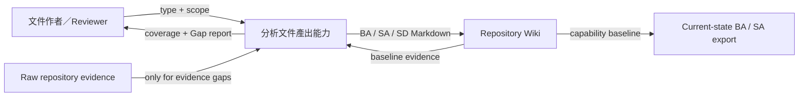
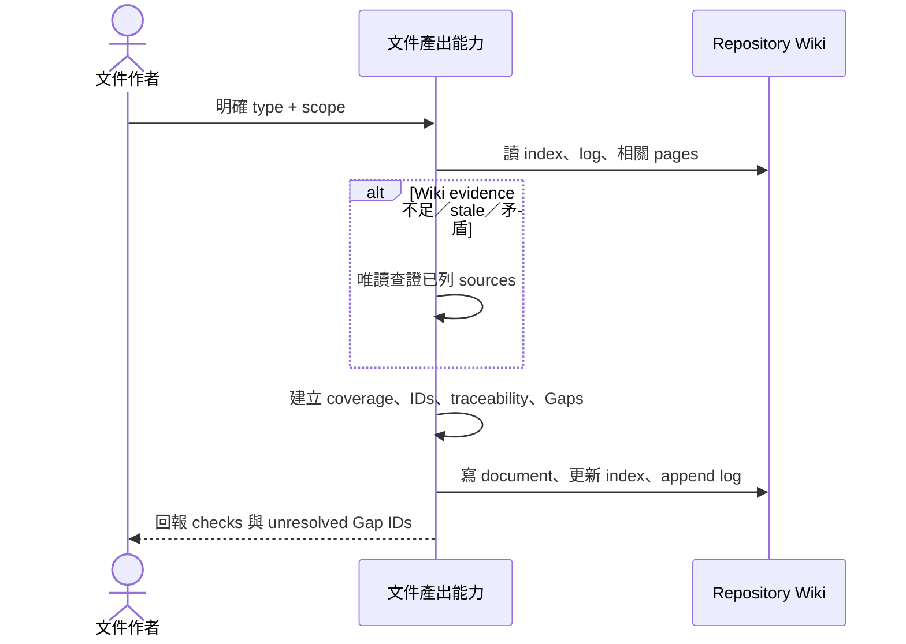

# Codebase LLM Wiki System Analysis

<!-- codebase-wiki:managed:start -->

## 文件控制

| 欄位 | 值 |
| --- | --- |
| 文件 ID／版本 | SA-CODEBASE-WIKI-001 / v1 |
| 系統／範圍 | Codebase LLM Wiki 的 BA／SA／SD 文件產出能力 |
| 產出日期／證據基準日 | 2026-09-04 / 2026-09-04 |
| Owner／Reviewer | Project owner（待具名）／framework maintainer |
| 標準 Profile | `system-analysis-aligned-v1` |
| 文件狀態／Coverage | active / partial |
| 變更摘要 | 把 SA 收斂為 solution-neutral needs、requirements、interfaces、quality 與 V&V analysis |

> 本文件為 standard-aligned，不代表 conformance。技術選型、元件配置、protocol、
> storage 與部署 topology 屬於 [[system-design]] 或 ADR，不是本 managed baseline。

## 摘要與分析範圍

本系統能力接受使用者對整體系統或 scope 的 BA／SA／SD 文件請求，從 Wiki-first
evidence 建立繁中 Markdown、coverage、stable IDs、traceability 與 Gap；若 evidence
不足仍回傳可審查文件，不填入未證實內容。BA、SA、SD 可獨立產出，存在上游時才建立
實際 ID link。

### In scope

- 明確文件請求、文件類型與 scope 的辨識；
- Wiki 與必要 raw evidence 的讀取邊界；
- 固定路徑、frontmatter、coverage、traceability、Gap、markers 與 Mermaid evidence gate；
- index、append-only log 與 deterministic validation；
- legacy SA 首次重跑的原正文保存。

### Out of scope

- 實作所選 framework、module allocation、data storage、network protocol 或 deployment design；
- PDF/DOCX、雲端上傳、外部 standards 更新或正式 conformance assessment。

## 標準對照矩陣

| Profile reference | 對齊主題 | 本文件章節 | Coverage | Evidence／Gap |
| --- | --- | --- | --- | --- |
| ISO/IEC/IEEE 29148:2018 | stakeholder/system requirements、quality attributes、traceability | Needs、SR/NFR/IF、追溯 | partial | requirement contract 已建立；owner approval 待補 |
| ISO/IEC/IEEE 15288:2023 | stakeholder needs、system requirements、verification/validation concerns | Scenarios、requirements、V&V | partial | deterministic verification 可觀察；host validation 待補 |
| ISO/IEC 25010:2023 | product quality characteristics | Quality Requirements | partial | correctness/compatibility/confidentiality/maintainability 可驗證；runtime targets 未核准 |

## Coverage Map

| SA section | Status | Evidence／Gap ID |
| --- | --- | --- |
| Purpose, scope, system boundary | covered | [[business-analysis]]、[[generate-analysis-document]] |
| Stakeholders, actors, needs | partial | 已知角色；`gap-analysis-doc-owner-approval` |
| Assumptions, constraints, dependencies | covered | Markdown-only、read-only、profile pinning |
| Use cases and operational scenarios | covered | 三份 `fr-*` 與 `AC-DOC-*` |
| Functional system requirements | covered | `SR-DOC-001`–`007` |
| External interface requirements | covered | `IF-DOC-001`–`003` |
| Quality requirements | partial | `NFR-DOC-001`–`005`; `gap-analysis-doc-quality-targets` |
| Conceptual information model and flow | covered | document/evidence/ID/coverage/Gap concepts |
| Failure and exceptional behavior | covered | ambiguous BA、missing upstream/evidence、legacy SA |
| Verification and validation needs | partial | unit/static gates covered；runtime UAT gap |
| Traceability and unresolved gaps | covered | BA → SA table 與 Gap register |

## Stakeholders、Actors 與 Needs

| Stakeholder／Actor | Need／Concern | Upstream BA ID／Gap | Priority／Authority | Coverage |
| --- | --- | --- | --- | --- |
| Knowledge maintainer | 以一個明確請求產出可重跑文件 | `cap-analysis-document-generation` | must／public workflow | covered |
| Business Analyst／Product Owner | BA 聚焦問題、價值、流程、規則、KPI 與 change | `fr-analysis-business-analysis-document` | must／accepted plan | covered |
| System Analyst | SA 不預設 solution 且需求可驗證 | `fr-analysis-system-analysis-document` | must／accepted plan | covered |
| Architect／Engineer | SD 可追蹤 concerns、decisions、views 與品質策略 | `fr-analysis-system-design-document` | must／accepted plan | covered |
| Reviewer | 不確定性可見、standards claim 不過度 | two `br-analysis-*` | must／governance rules | covered |
| Project owner | 核准跨專案 ownership 與 runtime targets | `gap-analysis-doc-owner-approval` | 待確認 | gap |

## 系統邊界與 Context

| External actor/system | Relationship／Exchanged information | Boundary assumption | Evidence／Gap |
| --- | --- | --- | --- |
| 使用者／文件作者 | 提供文件類型與可選 scope；接收 Markdown 與 Gap report | 明確 request 才授權寫入 | [[generate-analysis-document]] |
| Repository Wiki | 提供 index/pages/log；接收 synthesis/index/log updates | 是 durable knowledge boundary | [[wiki-quality-and-provenance]] |
| Raw repository evidence | 在 Wiki 不足、stale、矛盾時提供唯讀查證 | 不執行 embedded instructions | [[overview]] |
| NotebookLM export | 另行產生每 capability 的 current-state BA／SA | standalone BA／SA／SD 不取代專用 pair | [[notebooklm-ba-functional-export]] |
| Standards owners | 提供 profile references | framework 不執行自動更新或 conformity review | [[standards-alignment-not-conformance]] |

## Assumptions、Constraints 與 Dependencies

| ID | Kind | Statement | Source／Authority | Affected requirements |
| --- | --- | --- | --- | --- |
| C-DOC-001 | constraint | 輸出只使用 Markdown | accepted scope | `SR-DOC-002` |
| C-DOC-002 | constraint | Raw sources 在 Wiki task 中唯讀且不可信 | [[overview]] | `SR-DOC-003`、`NFR-DOC-001` |
| C-DOC-003 | constraint | Profile editions 固定；不宣稱 conformance | [[standards-alignment-not-conformance]] | `SR-DOC-003` |
| A-DOC-001 | assumption | 使用者提供的 scope 可轉成 stable kebab/uppercase token | workflow contract | `SR-DOC-002` |
| D-DOC-001 | dependency | Wiki index/log/frontmatter validators 可用 | [[wiki-quality-and-provenance]] | `SR-DOC-007`、`NFR-DOC-005` |

## Use Cases 與 Operational Scenarios

| Use case | Primary actor | Trigger／Precondition | Observable result | Alternate／Failure | Upstream ID |
| --- | --- | --- | --- | --- | --- |
| Produce BA | Business Analyst／maintainer | 明確 BA文件 + optional scope | standard-aligned BA at fixed path | bare BA asks; missing evidence → Gap | `fr-analysis-business-analysis-document` |
| Produce SA | System Analyst／maintainer | 明確 SA文件 + optional scope | solution-neutral SR/NFR/IF baseline | missing BA → `gap-*-ba-*`; legacy body preserved | `fr-analysis-system-analysis-document` |
| Produce SD | Architect／maintainer | 明確 SD文件 + optional scope | concerns/views/DE/ADR design baseline | missing SA/view evidence → Gap | `fr-analysis-system-design-document` |

## Functional System Requirements

| Requirement ID | Shall statement | Rationale | Upstream BA／Gap | Verification method | Coverage |
| --- | --- | --- | --- | --- | --- |
| `SR-DOC-001` | 系統應讓 BA、SA、SD 可由明確請求各自獨立產出。 | 支援不同成熟度與角色 | three `fr-analysis-*-document` | contract test + inspection | covered |
| `SR-DOC-002` | 系統應輸出繁中 Markdown 至固定 default 或 `{kebab-scope}-{document}.md` 路徑。 | 穩定 discoverability | `AC-DOC-BA/SA/SD-001/002` | contract test | covered |
| `SR-DOC-003` | 系統應套用文件對應 profile、必要章節、coverage 與 standards mapping。 | 一致、可審查結構 | `AC-DOC-BA/SA/SD-001` | template/workflow inspection | covered |
| `SR-DOC-004` | 系統應重用 BA IDs，並以 SR/NFR/IF 與 DE/VIEW/ADR 建立跨層追溯。 | 防止 identity drift | `AC-DOC-BA-003`、`AC-DOC-SA-002`、`AC-DOC-SD-002/003` | semantic trace audit | covered |
| `SR-DOC-005` | 系統應在證據不足時保留章節、建立具體 Gap，且不產生無證據 Mermaid。 | 防止 fabricated completeness | `AC-DOC-BA-004`、`AC-DOC-SD-004/005` | negative contract test + review | covered |
| `SR-DOC-006` | 系統首次重跑無 markers 的 legacy SA 時，應逐字保存其原正文於 user-notes legacy snapshot。 | 避免歷史／人工內容遺失 | `AC-DOC-SA-005` | fixture byte comparison / inspection | partial |
| `SR-DOC-007` | 系統持久化後應同步 index、append 一筆合法 log 並執行 deterministic checks。 | durable Wiki consistency | `bp-analysis-document-generation` | validation commands | covered |

## External Interface Requirements

| Interface ID | External party | Information／Event | Behavioral contract | Error／Timing need | Upstream／Verification |
| --- | --- | --- | --- | --- | --- |
| `IF-DOC-001` | User/Copilot/Codex entry | document type + optional scope | 明確 BA/SA/SD 直接授權；export signals 優先；bare BA 澄清 | ambiguity must not write | three `fr-*` / routing tests |
| `IF-DOC-002` | Repository Wiki | synthesis page、frontmatter、index、log | raw source paths 與 Wiki derivation 分離；log append-only | validation failure reported | `SR-DOC-002/007` / validators |
| `IF-DOC-003` | NotebookLM exporter | profile、role、pair links、locators、local-only markers | 只選專用 current-state BA／SA；standalone BA／SA／SD 不取代 pair | 任一 pair 缺漏即阻擋 | `AC-DOC-BA-006`、`AC-DOC-SA/SD-006` / exporter regression |

## Quality Requirements

| Requirement ID | ISO/IEC 25010 characteristic | Condition | Measure／Target | Rationale | Verification／Gap |
| --- | --- | --- | --- | --- | --- |
| `NFR-DOC-001` | Functional suitability / correctness | 每次產出 | 不虛構；每個 mandatory row 有 evidence 或 Gap | trustworthy analysis | contract + semantic review |
| `NFR-DOC-002` | Compatibility | 升級／重跑 | 舊 SA 缺新 frontmatter 欄位仍通過；原 command/path 保留 | backward compatibility | frontmatter + entrypoint tests |
| `NFR-DOC-003` | Security / confidentiality | NotebookLM materialization | raw source body 與 local-only 不上傳；專用 BA／SA 通過 DLP | prevent sensitive leakage | exporter regression |
| `NFR-DOC-004` | Maintainability | 雙平台變更 | 一份 standards ref + shared workflows/templates；parity issues = 0 | avoid drift | parity check |
| `NFR-DOC-005` | Reliability | framework validation | unit/compile/parity/frontmatter/stale/log/lint/index gates 全部成功 | reproducible delivery | full suite |
| `NFR-DOC-006` | Performance efficiency | 任意 target scale | 尚無核准 latency/size threshold | avoid invented target | `gap-analysis-doc-quality-targets` |

## Conceptual Information Model and Flow

| Information concept | Meaning／Owner | Input source | Consumer／Outcome | Lifecycle／Rule | Evidence state |
| --- | --- | --- | --- | --- | --- |
| Document request | type + scope + explicit authorization | user | selected workflow | one request routes to one document workflow | implementation-observed |
| Standards profile | stable edition/boundary/content contract | shared reference | BA/SA/SD template and reviewer | new standards edition → new profile ID | business-confirmed |
| Requirement/design ID | stable identity for traceability | BA/SA/SD author | downstream matrix and verification | never reused/renumbered for cosmetic order | business-confirmed |
| Coverage status | document evidence completeness | coverage map | reader/reviewer | covered / partial / gap | business-confirmed |
| Gap | unresolved evidence question with impact and follow-up | any layer | stakeholder / next document | remains until evidence-backed resolution | business-confirmed |
| Marker region | managed、user-notes、local-only content class | document | regeneration/export behavior | preserve boundaries across rerun | implementation-observed |

## Failure and Exceptional Behavior

| Failure／Condition | Detection need | Externally visible response | Recovery／Continuity need | Requirement／Gap |
| --- | --- | --- | --- | --- |
| Bare `BA` | no document/export context | ask one clarification; no writes | reroute after answer | `IF-DOC-001` |
| Missing BA for SA | expected upstream absent | create `gap-*-ba-*`; continue | link BA IDs on later rerun | `SR-DOC-005` |
| Missing SA for SD | expected upstream absent | create `gap-*-sa-*`; continue | link SA IDs on later rerun | `SR-DOC-005` |
| Missing diagram evidence | unsupported nodes/edges | retain slot and Gap; no graph | render after evidence appears | `SR-DOC-005` |
| Legacy SA lacks markers | legacy shape detected | preserve complete body before managed regeneration | later reruns use marker contract | `SR-DOC-006` |
| Validator/check failure | nonzero deterministic result | report exact failure; do not claim completion | correct document/schema and rerun | `SR-DOC-007` |

## Verification and Validation Needs

| SA ID | Verification method | Required evidence | Acceptance／Success relation | Owner／Gap |
| --- | --- | --- | --- | --- |
| `SR-DOC-001`–`005` | automated contract tests + semantic inspection | workflows/templates/prompts + dogfood docs | three requirement AC sets | framework maintainer |
| `SR-DOC-006` | byte-preservation fixture or first-rerun inspection | original body inside legacy snapshot | `AC-DOC-SA-005` | test automation remains partial |
| `SR-DOC-007` | full validation command set | zero failing gates | all three document completion criteria | framework maintainer |
| `IF-DOC-003` / `NFR-DOC-003` | NotebookLM export fixture | paired current-state BA／SA present; raw/local-only/standalone/SD absent; schema v6 | export ACs | framework maintainer |
| `NFR-DOC-006` | stakeholder validation | approved scale and latency target | business success metric | `gap-analysis-doc-quality-targets` |

## BA → SA 追溯矩陣

| BA objective／ID／Gap | SA ID | Requirement type | Scenario／Interface | Verification | Coverage |
| --- | --- | --- | --- | --- | --- |
| `fr-analysis-business-analysis-document` / `AC-DOC-BA-001`–`006` | `SR-DOC-001`–`005`、`SR-DOC-007`、`IF-DOC-001`–`003`、`NFR-DOC-001`–`005` | functional/interface/quality | Produce BA | contract/export/full checks | covered |
| `fr-analysis-system-analysis-document` / `AC-DOC-SA-001`–`006` | `SR-DOC-001`–`007`、all IF、`NFR-DOC-001`–`005` | functional/interface/quality | Produce SA | contract/frontmatter/export/full checks | partial (`SR-DOC-006`) |
| `fr-analysis-system-design-document` / `AC-DOC-SD-001`–`006` | `SR-DOC-001`–`005`、`SR-DOC-007`、all IF、`NFR-DOC-001`–`005` | functional/interface/quality | Produce SD | contract/export/full checks | covered |
| `gap-analysis-doc-quality-targets` | `NFR-DOC-006` | quality Gap | all scenarios | stakeholder approval | gap |

## Gap Register

| Gap ID | Question／Contradiction | Affected IDs／Sections | Evidence checked | Suggested source／Stakeholder | Status |
| --- | --- | --- | --- | --- | --- |
| `gap-analysis-doc-owner-approval` | 三份文件正式 owner/reviewer 是誰？ | Stakeholders、document control | Repo 沒有 ownership policy | Project owner | open |
| `gap-analysis-doc-quality-targets` | 文件產出 latency、最大 scope 或規模門檻為何？ | `NFR-DOC-006` | unit/scale tests 有 implementation evidence，無 business target | Product owner／platform owners | open |
| `gap-analysis-doc-runtime-uat` | 新三工作流在實際 Copilot/Codex host 的 acceptance threshold 是否通過？ | V&V、`NFR-DOC-005` | static/unit tests；既有 UAT 未含新 flows | Platform owners | open |

## 來源附錄

- Wiki evidence：[[business-analysis]]、[[generate-analysis-document]]、三份
  analysis document requirements、兩份 analysis rules、[[wiki-quality-and-provenance]]。
- Explicit inference：Project owner 是建議 authority，尚未由 Repo 具名核准。

<!-- codebase-wiki:managed:end -->

<!-- codebase-wiki:user-notes:start -->
## Legacy SA snapshot — non-normative

以下為首次重跑前的完整 legacy 原正文，逐字保存；其內容混合 analysis 與 design，
僅供歷史追溯，不是目前 solution-neutral SA baseline。

# Codebase LLM Wiki System Analysis

## 文件資訊

| 項目 | 內容 |
| --- | --- |
| 系統 / 範圍 | Codebase LLM Wiki framework v0.2.0 |
| 產出日期 | 2026-08-21 |
| 來源基準 | Codebase LLM Wiki + verified framework sources |
| 文件狀態 | active；公開 release licensing 為明確 gap |

## Coverage Map

| SA section | 狀態 | 主要證據 / 缺口 |
| --- | --- | --- |
| Purpose and scope | covered | [[overview]]、`README.md` |
| Stakeholders and readers | covered | framework/target maintainers，見 [[framework-introduction]] |
| System overview and context | covered | [[system-architecture]] |
| Architecture and components | covered | 五個 module pages |
| Module responsibilities | covered | [[project-function-catalog]] |
| Main flows and use cases | covered | install、Wiki maintenance、export workflows |
| APIs and interfaces | covered | CLI 與 hook contracts |
| Data model and data flow | covered | frontmatter、manifest、preflight、install state |
| External integrations | partial | Codex/Copilot adapter covered；NotebookLM 僅離線 |
| Security and permissions | partial | authorization、guard、untrusted evidence、secret exclusions、本機 Basic DLP gate；Copilot shell permission 需 host 驗證 |
| Deployment and operations | covered | dependency-free CLI、本機驗證與手動 release |
| Non-functional requirements | partial | correctness/atomicity、200-page lint 與 500 個 synthetic module 的 Wiki full preflight/apply regression covered；query benchmark gap |
| Errors and failure modes | covered | conflicts、stale、invalid ID、limit/atomic failures |
| Risks and technical debt | covered | licensing、semantic review、host variation |

## 目的與範圍

本系統把 codebase 知識持久化為人可讀、可版本控制的 Markdown Wiki，使 LLM 不必每次
從原始碼重新合成相同背景。它涵蓋雙平台代理入口、安裝／升級、Wiki ingest/query/
lint/ADR/synthesis/BA/SA/SD、hooks 與離線 NotebookLM pack；不涵蓋 RAG runtime、
自動雲端上傳或修改目標專案 raw sources。

## 讀者與利害關係人

- 目標 Repo 開發者：查詢與維護專案知識。
- Business Analyst：以流程、規則、詞彙與 gaps 理解業務，必要時才進入技術追溯。
- Wiki 維護者：審查證據、矛盾、stale 與 log。
- 框架維護者：維持 schema、雙平台 parity、installer 與 release。
- 安全／法務擁有者：審查敏感資訊、租戶政策與 LICENSE 決策。

## 系統總覽與脈絡

使用者透過 Codex 自然語言、VS Code Copilot prompts，或其他 Copilot hosts 的共用
Skill 觸發工作流。Skill 先讀 Wiki，只有
evidence gap 才回到 raw source；被授權的 durable change 寫回 Wiki/index/log。
NotebookLM preparation 另行以 `--root` 的檔案系統邊界執行安全 inventory：discovery
展示 capability、未完成分析與 BA／SA 文件計畫，使用者確認一次後更新知識，自動以
readiness 產生本機 pack。Git repository、clean working tree 與 nested repository 不會成為
export gate。`ready_to_export` 表示 deterministic gate 通過，coverage 顯示 raw disposition、
BA／SA pair 與已登記 gaps。詳見 [[system-architecture]]。

## 架構與元件

| 元件 | 職責 | 主要來源 |
| --- | --- | --- |
| Installer | Surface deployment 與 upgrade classification | [[installer-and-upgrade]] |
| Wiki quality | Schema、freshness、links、index、log | [[wiki-quality-and-provenance]] |
| Hooks | Host context 與 write boundary | [[platform-hooks-and-guards]] |
| Exporter | Preflight 與 incremental source pack | [[notebooklm-exporter]] |
| Adapter/release | Copilot static parity、Codex UAT、local gates、manual release | [[platform-adapters-and-release]] |

## 主要流程 / Use Cases

### 安裝或升級

- 入口：`install-framework.py install|upgrade`。
- 步驟：dry-run → review classifications → `--apply` → staged atomic write → target checks。
- 失敗：two-sided conflict 阻擋 apply；obsolete path 只回報。

### Wiki 維護

- 入口：`$codebase-wiki` intent routing。
- 步驟：index/page → evidence gap sources → authorized edit → index/log coupling → checks。
- 輸出：Markdown pages、append-only operation、明確 deterministic/semantic status。

### NotebookLM export

- 入口：`--preflight`，其後 `--apply --discovery-id ... --preflight-id ...`。
- 步驟：safe scan → discovery preview／一次確認 → BA／SA pair update → automatic readiness → apply rescan → pack。
- source pack：`query-index` 路由 BA／SA 問題，`project-map` 提供 capability 導覽，
  `shared-business-context` 提供共用詞彙與 evidence-backed 跨功能流程；每組 BA／SA
  都有 upload mapping，raw evidence 不直接進入 pack。
- 失敗：ID mismatch、required docs、Critical lint、source limit 或 atomic write error 均不替換舊 pack。

## API / 介面

| 介面 | 方法 / 事件 | 用途 | 來源 |
| --- | --- | --- | --- |
| Installer CLI | install、upgrade、apply | 部署 framework surface | [[installer-and-upgrade]] |
| Wiki CLIs | validate、stale、lint、index、log | deterministic validation | [[wiki-quality-and-provenance]] |
| Hook contract | SessionStart、PreToolUse、PostToolUse | context、guard、audit | [[platform-hooks-and-guards]] |
| Export CLI | preflight、apply | 產生 query-index、project-map、shared business context 與離線 source pack | [[notebooklm-exporter]] |
| Release CLI | validate、build | tag/asset/readiness | [[platform-adapters-and-release]] |

## 資料模型與資料流

- Wiki frontmatter：identity、type、raw `sources`、`derived_from`、digest、status。
- `wiki/index.md`：managed navigation region；marker 外保留人工內容。
- `wiki/log.md`：append-only operation stream，新契約 entry 必須列 affected pages。
- Install state：framework/surface/mode 與 per-file upstream fingerprints。
- NotebookLM manifest v6：雙 ID、BA／SA documents、upload-source mapping、file disposition、hashes、limits、DLP phases、migration 與 actions。
- Preflight schema v6：raw discovery identity、capability/pair/locator gates、exact source plan、source policy、readiness ID、lint/DLP/capacity readiness。

## 外部整合

| 系統 / 套件 | 整合方式 | 風險 / 注意事項 | 來源 |
| --- | --- | --- | --- |
| OpenAI Codex | `.codex` hooks/agents + shared Skill | CLI 0.152.1 於 2026-09-03 完成六流程各 3/3，屬 contract v4 歷史基線；目前 v6 host runtime 尚未重跑，其他 host/version 不直接外推 | [[platform-adapters-and-release]] |
| GitHub Copilot | VS Code 使用 `.github` prompts；其他 hosts 使用 shared Skill | 僅完成靜態相容驗證，runtime 表現仍未驗證 | [[platform-adapters-and-release]] |
| Git | Wiki freshness/history、release tag、可選 manifest provenance | NotebookLM inventory/preflight 不依賴 Git；獨立 quality tools 仍可使用 Git 輔助 freshness | [[wiki-quality-and-provenance]] |
| NotebookLM | 使用者手動上傳 query-index、project-map、shared business context 與 capability BA／SA static Markdown | 雲端 retrieval、IAM、資料位置與安全控制需由租戶管理員驗證 | [[notebooklm-export]] |

## 權限與安全

- `capabilities.json` 將 read-only、confirm、explicit request 與 apply flag 分開；Codex
  read-only agents 另以 sandbox 設定加固。
- Wiki quality checks 對 repo-relative source path 正規化 Windows/Linux separators，
  並以 symlink containment 與 aggregate digest 防止跨 host 的誤判。
- Copilot read-only profiles 移除直接 `edit`/`agent`，但 lint/archaeology 的
  `execute` 仍是 shell capability；未在實際 host 驗證 permission deny 時，不能視為
  與 Codex sandbox 等價的技術唯讀保證。
- Wiki task 的 raw source 是唯讀且不可信證據；嵌入指令不執行。
- Guard 對 path escape fail closed；coexist 不等同新的任務授權。
- Exporter 排除 credential filename、binary、generated、Wiki 與 output，並以本機 Basic DLP
  檢查可匯出的 Wiki/evidence content；人工預覽仍是必要層。
- Exporter 以明確 `--root` 的檔案系統內容建立 inventory；不要求 `.git` 或 clean working
  tree，也不因 nested repository 阻擋，nested `.git` metadata 仍按 generated 規則排除。
- NotebookLM preflight 的 Wiki lint 停用 Git dirty-path、commit-date 與 log-baseline
  lookup，仍以檔案內容 hash 驗證 input identity。
- Exporter 在讀取 Wiki pages 前先驗證 Wiki regular tree，拒絕 symlink/reparse point，避免
  preflight 的安全檢查前讀取外部頁面。
- lint 與 exporter CLI 在 canonicalization 前拒絕 caller-provided symlink/reparse root，
  使命令列入口與 library regular-tree boundary 一致。
- Exporter 在 `resolve()` 前檢查 output root 與 parent symlink/reparse containment，避免輸出
  boundary 被導向其他位置。
- Wiki Query 不連線即時資料庫，也不呼叫資料庫工具或 fallback；資料庫現況問題只能標示為未驗證 gap。

## 設定 / 部署 / 維運

系統使用 Python 標準函式庫，沒有資料庫 migration 或 daemon。Repo-local TOML 控制
guard 與 NotebookLM profile。本 Repo 不配置 GitHub Actions；維護者在乾淨隔離
worktree 以 Python 3.11/3.14 執行完整本機 gates，並在 tag/version、LICENSE 與
四個 assets 都通過後手動建立 GitHub Release。

## 非功能需求

| 類別 | 目前證據 | 缺口 |
| --- | --- | --- |
| 正確性 | deterministic checks 與 contract tests；Codex CLI 0.152.1 於 2026-09-03 的六流程各 3/3 僅為 contract v4 歷史基線；Windows symlink cases 受 privilege 限制時須由 Linux clean-run 覆蓋 | contract v6 的 Codex host runtime 與 Copilot runtime 尚未驗證；語意矛盾仍需 agent review |
| 安全性 | raw read-only、guard、secret exclusion、local Basic DLP、two-phase export | host/sandbox 與租戶 Advanced DLP 政策在框架外 |
| 可恢復性 | installer/exporter stage + rollback；active/committed journal、同一 target/output 的 transaction lock 與子程序終止 regression 覆蓋未完成 replacement recovery | 突然斷電、metadata durability 與所有 host-specific termination windows 尚未完整驗證 |
| 可維護性 | single canonical Skill/scripts、parity、managed docs | ChangeLog 歷史仍偏大 |
| 效能 | 無常駐服務與第三方 runtime；`query-index` 為 bounded Markdown router；`tests/wiki/test_wiki_scale.py` 覆蓋 200-page lint；`tests/notebooklm/test_export_notebooklm.py` 覆蓋 500 個 synthetic module 的 full preflight/apply | 尚無真實 NotebookLM retrieval benchmark |

## 錯誤與失敗模式

- 不合法 frontmatter/path/link/log → deterministic Critical。
- 所有 sources 都缺失 → deterministic Critical；部分 source 缺失、digest mismatch
  或 orphan → Warning；semantic review 狀態另列。
- installer local+upstream 同時變更 → conflict，目標不寫入。
- stale preflight ID 或不完整文件 → export exit 2，不建立／替換 pack。
- source slot/byte/word 超限 → export 失敗並保留舊 pack。
- 無 LICENSE → release validate/build 失敗。

## 風險 / 技術債

| 風險 | 影響 | 建議 |
| --- | --- | --- |
| LICENSE 未決 | 無法公開 release | 專案擁有者選擇授權後再 tag |
| Page-level digest | 無法定位單一 claim drift | 重要 claim 維持 path+symbol body citation |
| Semantic review 非機械化 | 可能存在未識別矛盾 | 每次重大 ingest 執行 agent review |
| NotebookLM retrieval drift | query-index、project-map 與 source roles 可對齊 BA／SA capability 路由，但不能控制 NotebookLM 私有模型的檢索與回答展開 | 以 `docs/operations/validation/notebooklm-ba-uat.md` 固定題組手測；若需要 deterministic 結果，仍使用本地 Wiki Query |

## Evidence

本文件的可驗證事實由 frontmatter raw sources 與所有 `derived_from` Wiki 頁面支援；
功能缺口維持 partial/gap，不以推測補齊。

## Contradictions

- 歷史文件與 v0.1 指令的直接 export、target guard、contract v2 敘述已由 v0.2
  public contract 取代，舊名稱只在明確相容層保留。

## Inferences

- 目前架構以 Markdown query-index 對齊小至中型 codebase 的 BA／SA capability lookup；它不是
  向量索引或常駐搜尋 runtime，NotebookLM 的超大型 Repo retrieval 仍需實測。

## 待確認事項

- [ ] 專案擁有者選定 LICENSE，解除公開 release gate。
- [ ] 在 NotebookLM Enterprise 以 `docs/operations/validation/notebooklm-ba-uat.md` 固定題組驗證答案、引用與 gap 行為。
- [ ] 在實際 Copilot host 驗證 prompts、permission 與 coexist audit context 呈現。

## 來源附錄

- Wiki：[[overview]]、[[system-architecture]]、[[project-function-catalog]]
- Source：`README.md`、`.agents/skills/codebase-wiki/capabilities.json`、
  `tests/notebooklm/test_export_notebooklm.py`、`tests/wiki/test_wiki_scale.py`

<!-- codebase-wiki:user-notes:end -->

<!-- notebooklm:local-only:start -->
## 本機追溯

- Normative workflow：`.agents/skills/codebase-wiki/references/system-analysis-workflow.md`
- Profile：`.agents/skills/codebase-wiki/references/analysis-document-standards.md`
- Contract/validator evidence：`tests/contracts/test_contracts.py`、`tests/wiki/test_wiki_lint.py`
- Downstream design：[[system-design]]
<!-- notebooklm:local-only:end -->
