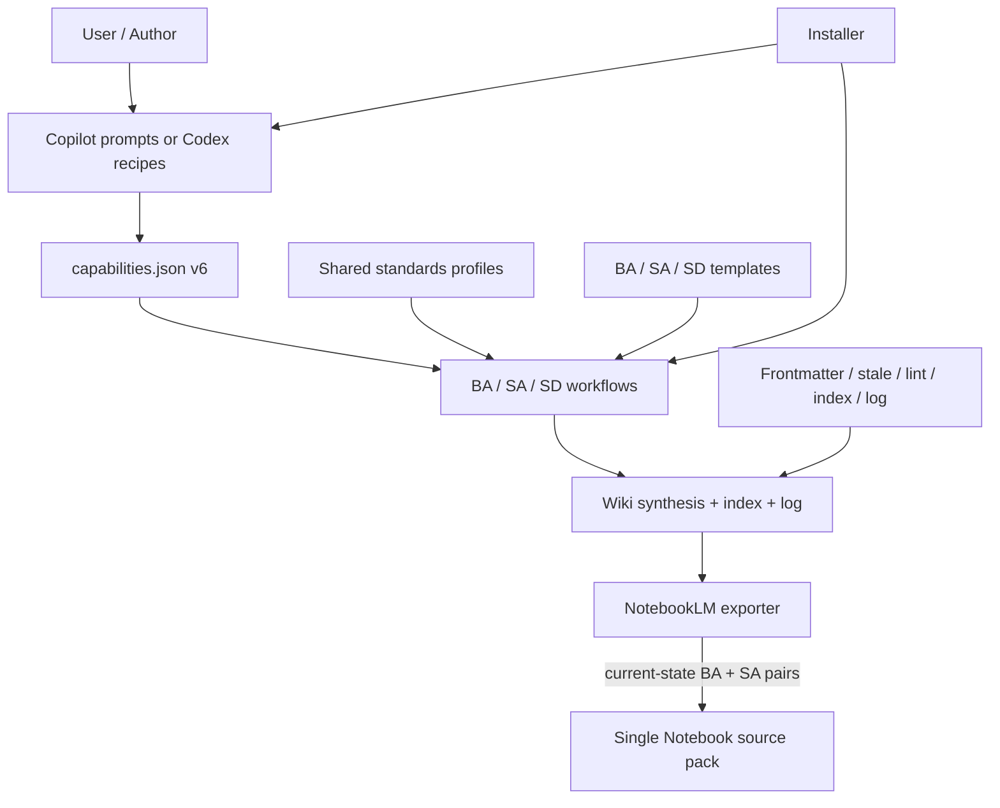
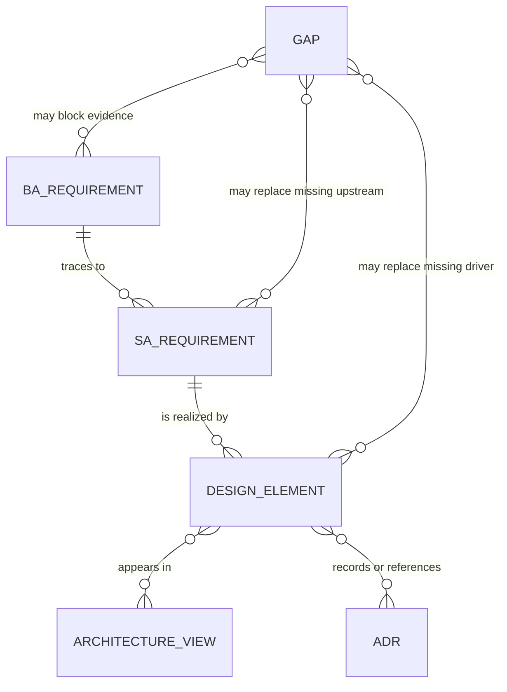
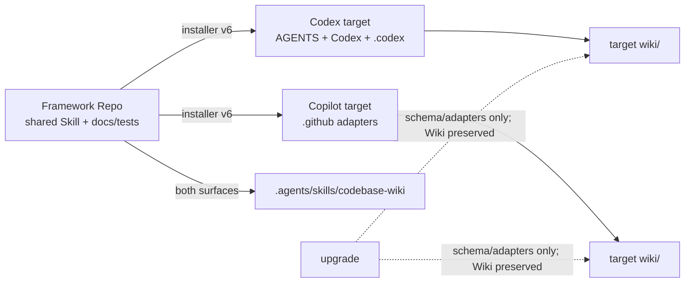
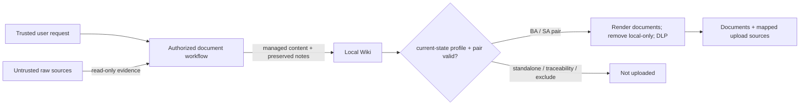

# Codebase LLM Wiki System Design

<!-- codebase-wiki:managed:start -->

## 文件控制

| 欄位 | 值 |
| --- | --- |
| 文件 ID／版本 | SD-CODEBASE-WIKI-001 / v1 |
| 系統／範圍 | Codebase LLM Wiki 的 BA／SA／SD 文件產出能力 |
| 產出日期／證據基準日 | 2026-09-04 / 2026-09-04 |
| Owner／Reviewer | Project owner（待具名）／framework maintainer |
| 標準 Profile | `system-design-aligned-v1` |
| 文件狀態／Coverage | active / partial |
| 變更摘要 | 新增共享 profile、BA/SD workflows、重整 SA；目前 capability contract 為 v6 |

> 本文件為 standard-aligned，不代表 conformance。IEEE 1016-2009 只作
> inactive-reserved／informative 的歷史 SDD 組織參考；architecture-description
> baseline 使用 ISO/IEC/IEEE 42010:2022。

## Architecture Summary、Scope 與 Design Drivers

設計沿用框架既有「共享 Skill 是 canonical contract、平台檔案是薄 adapters、Wiki 是
durable output」架構。新增一份 versioned standards reference，BA／SA／SD 各有獨立
workflow/template；capabilities v6 對兩平台公開 manifest-declared operations／groups。現有
frontmatter validator、installer、index/log/lint 與 NotebookLM exporter 只作最小擴充，
不新增 runtime generator 或 dependency。

| Driver | Upstream SA ID／Gap | Design consequence | Priority／Risk |
| --- | --- | --- | --- |
| 三份文件可獨立產出 | `SR-DOC-001`、`002` | 三組 operation/workflow/template；兩個新 Copilot prompts | must |
| 共用 standards 與 layer boundary | `SR-DOC-003`、`NFR-DOC-004` | 單一 `analysis-document-standards.md` + versioned profile IDs | must |
| 不完整 evidence 不得被隱藏 | `SR-DOC-005`、`NFR-DOC-001` | coverage/Gap/diagram gate in every template | must |
| 向後相容 | `SR-DOC-006`、`NFR-DOC-002` | optional schema fields + legacy SA preservation procedure | must |
| NotebookLM 不變 | `IF-DOC-003`、`NFR-DOC-003` | role-based selection and local-only stripping reused; Wiki 不進 raw discovery identity | must |
| 可驗證交付 | `SR-DOC-007`、`NFR-DOC-005` | contract/frontmatter/export/installer tests + standard Wiki checks | must |
| 正式架構決策權責 | `gap-analysis-doc-formal-adr` | `DE-*` 標為 observed，未冒稱 accepted ADR | open risk |

## 標準對照矩陣

| Profile reference | 對齊主題 | 本文件章節 | Coverage | Evidence／Gap |
| --- | --- | --- | --- | --- |
| ISO/IEC/IEEE 42010:2022 | stakeholders、concerns、viewpoints/views、correspondences、decisions/rationale | Concerns、View Catalog、DE、Cross-view | partial | views 有 evidence；formal ADR 待補 |
| ISO/IEC 25010:2023 | quality characteristics and design strategy | Quality Strategy | partial | deterministic quality tactics implemented；runtime efficiency target gap |
| IEEE 1016-2009 (informative) | historical SDD navigation | document section organization | covered | 明確排除為 conformance basis |

## Coverage Map

| SD section | Status | Evidence／Gap ID |
| --- | --- | --- |
| Architecture scope and design drivers | covered | `SR/NFR/IF-DOC-*` |
| Stakeholders and concerns | partial | roles known；`gap-analysis-doc-owner-approval` |
| Viewpoints, views, correspondences | covered | five `VIEW-DOC-*` definitions and models |
| Architecture decisions and rationale | partial | `DE-DOC-001`–`007`; `gap-analysis-doc-formal-adr` |
| Component/static structure | covered | shared skill/adapters/scripts/Wiki structure |
| Runtime behavior | covered | routing → evidence → merge → coupling → checks |
| Data design | covered | frontmatter, IDs, marker regions, Wiki links |
| Interface design | covered | manifest/prompts/recipes/filesystem/export roles |
| Deployment and operations | covered | installer surface and target Wiki boundary |
| Security architecture | partial | raw read-only/roles/local-only/guards covered；host permissions remain external |
| Quality strategies | partial | automated gates covered；`NFR-DOC-006` target missing |
| Traceability, risks, and Gaps | covered | SA → SD matrix and registers |

## Stakeholders and Concerns

| Stakeholder | Concern | Priority | Addressed by View／Decision | Evidence／Gap |
| --- | --- | --- | --- | --- |
| Document author | discoverable entrypoint、stable output、notes survive rerun | high | `VIEW-DOC-RUNTIME`、`DE-DOC-002/006` | workflows/templates |
| Analyst | BA/SA abstraction boundary and evidence fidelity | high | `VIEW-DOC-DATA`、`DE-DOC-001/003` | profiles + contract tests |
| Architect／Engineer | design detail and SA traceability | high | `VIEW-DOC-COMPONENT`、`DE-DOC-004` | SD workflow/template |
| Notebook owner／Security reviewer | no technical/local-only leakage | high | `VIEW-DOC-SECURITY`、`DE-DOC-005` | exporter regression |
| Repository maintainer | install/upgrade safe; target Wiki untouched | high | `VIEW-DOC-DEPLOYMENT`、`DE-DOC-007` | installer tests |
| Project owner | decision and ownership authority | high | all views | `gap-analysis-doc-owner-approval`、`gap-analysis-doc-formal-adr` |

## Viewpoint and View Catalog

| View ID | Viewpoint／Model kind | Concern and audience | Elements／Relations | Correspondence |
| --- | --- | --- | --- | --- |
| `VIEW-DOC-COMPONENT` | implementation/static structure | maintainer：responsibility and canonical ownership | shared Skill, profiles, workflows, templates, adapters, validators, Wiki | runtime/data/deployment/security |
| `VIEW-DOC-RUNTIME` | document-generation sequence | author/reviewer：request-to-verified-output | route, Wiki read, optional raw check, merge, index/log, checks | component/data/security |
| `VIEW-DOC-DATA` | information/traceability model | analyst/architect：stable identity and preservation | frontmatter, IDs, Gap, markers, wikilinks | runtime/security |
| `VIEW-DOC-DEPLOYMENT` | installed repository layout | repository maintainer：surface and upgrade boundaries | shared Skill, Copilot/Codex adapters, starter Wiki | component/security |
| `VIEW-DOC-SECURITY` | trust/data-flow model | security/Notebook owner：read/write/upload boundaries | user input, raw sources, Wiki roles, local-only stripping | all views |

## Architecture and Design Decisions

| Design ID | Decision／Selected approach | Alternatives／Rationale | Upstream SA | Affected views | Status／Evidence |
| --- | --- | --- | --- | --- | --- |
| `DE-DOC-001` | 共用一份 versioned standards reference | 複製到三 workflows 容易 edition/semantics drift | `SR-DOC-003`、`NFR-DOC-004` | all | implementation-observed |
| `DE-DOC-002` | BA／SA／SD 各自 operation、workflow、template | 單一萬用 synthesis 無法可靠分離 layer boundary | `SR-DOC-001`–`003` | component/runtime | implementation-observed |
| `DE-DOC-003` | `standards_profile`／`coverage_status` 在 validator 選填、在新 workflows 必填 | 全域強制會破壞 legacy SA | `NFR-DOC-002` | data/runtime | implementation-observed |
| `DE-DOC-004` | 以 BA IDs → SR/NFR/IF → DE/VIEW/ADR 建立三層 identity | 章節／標題 links 不夠穩定 | `SR-DOC-004` | data | implementation-observed |
| `DE-DOC-005` | 沿用 exporter 的 role filter 和 local-only removal | 修改 schema/required set 會擴張既有 Notebook contract | `IF-DOC-003`、`NFR-DOC-003` | data/security | implementation-observed |
| `DE-DOC-006` | 使用 managed/user-notes/local-only markers；legacy SA first rerun verbatim preserve | destructive replacement 會遺失人工／歷史內容 | `SR-DOC-005/006` | runtime/data | implementation-observed |
| `DE-DOC-007` | Installer 發布 schema/adapters 但不寫 target Wiki | 自動生成文件會越過目標 Repo 授權與 evidence context | `SR-DOC-007`、`NFR-DOC-002` | deployment/security | implementation-observed |
| `gap-analysis-doc-formal-adr` | 尚無 accepted ADR 核准上述方案 | 本文件不能代替 decision authority | all | all | gap |

## Component／Static View

| Component／Element | Responsibility | Owned data／Interface | Dependencies | Upstream SA／Decision |
| --- | --- | --- | --- | --- |
| `analysis-document-standards.md` | profiles、edition、layer、coverage、ID/marker/diagram contract | three profile IDs | official standards references | `SR-DOC-003/004/005` / `DE-DOC-001` |
| Three workflow references | routing、source order、coverage、persistence/completion | BA/SA/SD workflow contracts | standards ref + exact template | `SR-DOC-001`–`007` / `DE-DOC-002` |
| Three templates | document shape and regeneration regions | frontmatter + managed/user/local blocks | workflow/profile | `SR-DOC-002`–`006` / `DE-DOC-002/003/006` |
| Capability manifest / parity | operations、intent groups、authorization、entrypoint mapping | contract v6 | platform prompts/recipes | `IF-DOC-001` / `DE-DOC-002` |
| Frontmatter validator | optional metadata value validation and compatibility | profile/coverage values | parser/tests | `NFR-DOC-002/005` / `DE-DOC-003` |
| Installer | distribute shared skill and selected platform adapters | install state v6; starter only on install | framework surface | `NFR-DOC-002` / `DE-DOC-007` |
| NotebookLM exporter | validate current-state BA／SA pairs、mask、map and preserve schema v6 | documents、sources、mapping、governance | Wiki frontmatter | `IF-DOC-003` / `DE-DOC-005` |
| Framework Wiki | dogfood BA/SA/SD and traceability evidence | requirements/process/rules/synthesis/index/log | all above | `SR-DOC-007` |



## Runtime View

| Scenario | Participants | Interaction／State | Failure／Concurrency behavior | SA／Design IDs |
| --- | --- | --- | --- | --- |
| New document | user, router, workflow, Wiki, validators | route → read → coverage/IDs → render/Gap → persist → verify | ambiguous BA asks; validation failure reported | `SR-DOC-001`–`005/007`, `DE-DOC-001/002` |
| Rerun marked document | workflow, document regions | replace managed; retain user notes/local-only | malformed/overlapping marker is Gap, no blind overwrite | `SR-DOC-005`, `DE-DOC-006` |
| First legacy SA rerun | workflow, legacy body, new template | capture body → new managed → verbatim legacy user notes | missing body boundary blocks destructive rewrite | `SR-DOC-006`, `DE-DOC-006` |
| Framework install/upgrade | installer, source schema, target | plan → apply schema/adapters; starter only on install | conflicts block; target Wiki preserved | `NFR-DOC-002`, `DE-DOC-007` |
| Notebook export | exporter, discovery, BA／SA pairs, local-only blocks | pair validation → render/mask/map → schema-v6 pack | missing pair/locator or drift blocks replacement | `IF-DOC-003`, `DE-DOC-005` |

```mermaid
sequenceDiagram
    actor Author
    participant Entry as Platform entry
    participant Workflow as BA/SA/SD workflow
    participant Wiki
    participant Check as Validators
    Author->>Entry: explicit document type + scope
    Entry->>Workflow: selected operation
    Workflow->>Wiki: read index/log/relevant pages
    opt evidence gap
        Workflow->>Workflow: inspect raw source read-only
    end
    Workflow->>Workflow: profile + coverage + IDs + diagrams/Gaps
    Workflow->>Wiki: merge document; update index; append log
    Workflow->>Check: validate full Wiki contract
    Check-->>Author: results + unresolved Gap IDs
```

## Data View

| Data element／Store | Logical／Physical form | Owner | Integrity／Lifecycle | Migration／Retention | Trace |
| --- | --- | --- | --- | --- | --- |
| Document metadata | Markdown YAML subset | frontmatter spec | enum/kebab/date/path validation | legacy missing new optional fields remains valid | `NFR-DOC-002`, `DE-DOC-003` |
| BA identity | `cap/fr/bp/br/AC-*` | BA pages/catalogs | reuse stable IDs | existing identities retained | `SR-DOC-004` |
| SA identity | `SR/NFR/IF-{SCOPE}-NNN` | SA managed block | atomic/testable; no renumber reuse | absent BA links use Gap | `SR-DOC-004/005` |
| SD identity | `DE-{SCOPE}-NNN`、`VIEW-{SCOPE}-{SLUG}`、ADR | SD managed block / decisions | cross-view trace | absent SA links use Gap | `SR-DOC-004/005` |
| Coverage | frontmatter aggregate + per-section rows | document/reviewer | active freshness kept separate | recomputed per rerun | `SR-DOC-003` |
| Gap register | stable ID/table row | originating layer | preserve until evidenced resolution | append resolution, do not erase history | `SR-DOC-005` |
| Document regions | HTML marker pairs | workflow/human/exporter | non-overlap and preservation | legacy SA migrates once | `SR-DOC-006`, `DE-DOC-006` |



## Interface Design

| Interface／IF ID | Protocol／Schema／Version | Authentication／Authorization | Error／Retry semantics | Consumer／Provider | Decision |
| --- | --- | --- | --- | --- | --- |
| `IF-DOC-001` | natural language / VS Code prompt frontmatter / manifest v6 mapping | explicit request policy | ambiguous bare BA produces clarification, no write | user ↔ platform adapter | `DE-DOC-002` |
| `IF-DOC-002` | Markdown + YAML frontmatter + HTML markers + wikilinks | repository write authorization | validator failure is visible; log append-only | workflow ↔ Wiki filesystem | `DE-DOC-003/006/007` |
| `IF-DOC-003` | dedicated profiles + schema-v6 document/source mapping | one-confirmation discovery plus automatic readiness | missing pair/locator or drift rejects; standalone/SD excluded | Wiki ↔ exporter | `DE-DOC-005` |

## Deployment and Operations View

| Node／Environment | Hosted elements | Connectivity／Trust zone | Scaling／Availability | Configuration／Observability | Evidence |
| --- | --- | --- | --- | --- | --- |
| Framework repository | shared skill, both adapters, tests, docs, dogfood Wiki | maintainer workspace | manual local verification | `capabilities.json`, validation commands | [[system-architecture]] |
| Installed Codex target | shared skill + AGENTS/Codex/.codex + starter Wiki on install | target repo boundary | no service/runtime dependency | install state and hooks | [[installer-and-upgrade]] |
| Installed Copilot target | shared skill + .github prompts/agents/hooks + starter Wiki on install | target repo boundary | host-dependent prompt execution | install state and static parity | [[platform-adapters-and-release]] |
| Existing target on upgrade | updated schema/adapters; pre-existing Wiki untouched | local repo authorization | conflict-safe preservation | dry-run plan + fingerprints | `DE-DOC-007` |



## Security View

| Trust boundary／Asset | Threat／Concern | Identity／Access control | Protection／Audit | Requirement／Decision |
| --- | --- | --- | --- | --- |
| Raw repository sources | embedded instruction or unintended mutation | workflow authorization + platform sandbox/guard | read-only rule, evidence labeling | `NFR-DOC-001`, `DE-DOC-001/007` |
| User-notes content | regeneration overwrite | marker ownership | preserve verbatim; legacy snapshot | `SR-DOC-006`, `DE-DOC-006` |
| Current-state BA／SA upload content | sensitive raw value or excessive source detail | dedicated profile + valid pair/locator | render boundary + local-only removal + DLP | `NFR-DOC-003`, `DE-DOC-005` |
| Standalone BA／SA／SD | accidental upload | non-export profile／traceability role | profile and role filters exclude | `IF-DOC-003`, `DE-DOC-005` |
| Target Wiki | installer overwrites local knowledge | install/upgrade scope | starter only on install; upgrade excludes Wiki | `NFR-DOC-002`, `DE-DOC-007` |
| Standards claim | false compliance representation | profile/disclaimer contract | tests + reviewer | `NFR-DOC-001`, `DE-DOC-001` |



## Quality Strategy

| NFR ID／Characteristic | Design tactic | Measure／Verification | Responsible element／View | Risk／Gap |
| --- | --- | --- | --- | --- |
| `NFR-DOC-001` / correctness | canonical profiles, Gap-on-unknown, standards disclaimer | contract tokens + semantic review | standards/workflows/templates; all views | reviewer judgment remains manual |
| `NFR-DOC-002` / compatibility | optional validator fields, command/path retention, legacy preservation | legacy fixture + installer preservation tests | validator/installer/runtime/data | full byte fixture should remain monitored |
| `NFR-DOC-003` / confidentiality | dedicated profiles + local-only stripping + three-surface DLP | current-state BA／SA visible; raw/standalone/SD hidden; schema v6 | exporter/security | tenant behavior external |
| `NFR-DOC-004` / maintainability | single shared reference and manifest-driven parity | parity issues = 0; resource install tests | component/deployment | profile updates require explicit migration |
| `NFR-DOC-005` / reliability | local full deterministic suite and Wiki gates | all commands exit 0 | runtime/deployment | dirty root requires isolated verification copy |
| `NFR-DOC-006` / performance | no new generator/runtime/dependency | no approved threshold | all | `gap-analysis-doc-quality-targets` |

## Cross-view Correspondences and Consistency

| Source element／View | Related element／View | Correspondence rule | Consistency evidence／Gap |
| --- | --- | --- | --- |
| `VIEW-DOC-COMPONENT` workflow/template | `VIEW-DOC-RUNTIME` selected operation | every manifest operation resolves to existing workflow/template/adapter | parity + installer tests |
| `VIEW-DOC-DATA` profile/coverage | all views | templates and dogfood docs use matching profile/role/IDs | frontmatter + contract tests |
| `VIEW-DOC-RUNTIME` merge | `VIEW-DOC-SECURITY` marker ownership | managed changes cannot remove user notes; local-only never uploaded | workflow contract + exporter regression |
| `VIEW-DOC-DEPLOYMENT` installer | `VIEW-DOC-DATA` target Wiki | upgrade files exclude `wiki/` | installer regression |
| `VIEW-DOC-SECURITY` role filter | `VIEW-DOC-RUNTIME` export | BA optional, SA/SD excluded, schema required set fixed | NotebookLM regression |

## SA → SD 追溯矩陣

| SA ID／Gap | Design ID／ADR | View | Quality／Security effect | Verification strategy | Coverage |
| --- | --- | --- | --- | --- | --- |
| `SR-DOC-001`–`003` | `DE-DOC-001/002/003` | component/runtime/data | correctness/maintainability | contract + parity | covered |
| `SR-DOC-004` | `DE-DOC-004` | data | traceability consistency | semantic matrix audit | covered |
| `SR-DOC-005/006` | `DE-DOC-006` | runtime/data/security | integrity and recoverability | marker/legacy inspection | partial |
| `SR-DOC-007` | `DE-DOC-007` | runtime/deployment | reliability | installer + full Wiki gates | covered |
| `IF-DOC-001/002` | `DE-DOC-002/003/006/007` | runtime/data/deployment | compatibility/integrity | prompt/recipe/frontmatter/installer tests | covered |
| `IF-DOC-003` | `DE-DOC-005` | data/security | confidentiality/compatibility | NotebookLM regression | covered |
| `NFR-DOC-001`–`005` | `DE-DOC-001`–`007` | all | listed quality strategies | full suite + review | partial |
| `NFR-DOC-006` / `gap-analysis-doc-quality-targets` | no approved tactic | all | performance target unknown | stakeholder decision | gap |
| `gap-analysis-doc-formal-adr` | no accepted ADR | all | decision authority | project owner/architect approval | gap |

## Risks、Technical Debt 與 Gap Register

| ID | Type | Question／Decision debt | Affected IDs／Views | Evidence checked／Owner | Status |
| --- | --- | --- | --- | --- | --- |
| `gap-analysis-doc-formal-adr` | gap | 是否需要 accepted ADR 核准 `DE-DOC-001`–`007`？ | all DE/views | Wiki decisions 目前無對應 ADR／Project owner | open |
| `gap-analysis-doc-owner-approval` | gap | 三份文件與 profile migration 的正式 owner/reviewer 是誰？ | controls/all views | Repo docs 無具名 ownership policy | open |
| `gap-analysis-doc-quality-targets` | gap | performance/scale target 為何？ | `NFR-DOC-006` | implementation tests only | open |
| R-DOC-SD-001 | risk | Legacy snapshot 使 SA 體積增加 | runtime/data | preservation 優先於 compactness | accepted trade-off |
| R-DOC-SD-002 | risk | Copilot runtime 與 host permission 未驗證 | deployment/security | static parity only | open via `gap-analysis-doc-runtime-uat` |

## 來源附錄

- Wiki evidence：[[system-analysis]]、[[business-analysis]]、[[system-architecture]]、
  [[project-function-catalog]]、[[installer-and-upgrade]]、[[notebooklm-exporter]]、
  [[wiki-quality-and-provenance]]。
- Implementation observation：`DE-DOC-*` 描述目前框架設計，未替代 accepted ADR。

<!-- codebase-wiki:managed:end -->

<!-- codebase-wiki:user-notes:start -->
## SD 人工補充

目前無人工補充。
<!-- codebase-wiki:user-notes:end -->

<!-- notebooklm:local-only:start -->
## 本機追溯

- Shared profile/workflow：`.agents/skills/codebase-wiki/references/analysis-document-standards.md`、`.agents/skills/codebase-wiki/references/system-design-workflow.md`
- Runtime components：`.agents/skills/codebase-wiki/scripts/install-framework.py`、`.agents/skills/codebase-wiki/scripts/validate-frontmatter.py`、`.agents/skills/codebase-wiki/scripts/notebooklm_exporter.py`
- Contract evidence：`.agents/skills/codebase-wiki/scripts/parity-check.py`、`tests/contracts/test_contracts.py`、`tests/wiki/test_wiki_lint.py`、`tests/notebooklm/test_export_notebooklm.py`、`tests/installer/test_install_framework.py`
<!-- notebooklm:local-only:end -->
